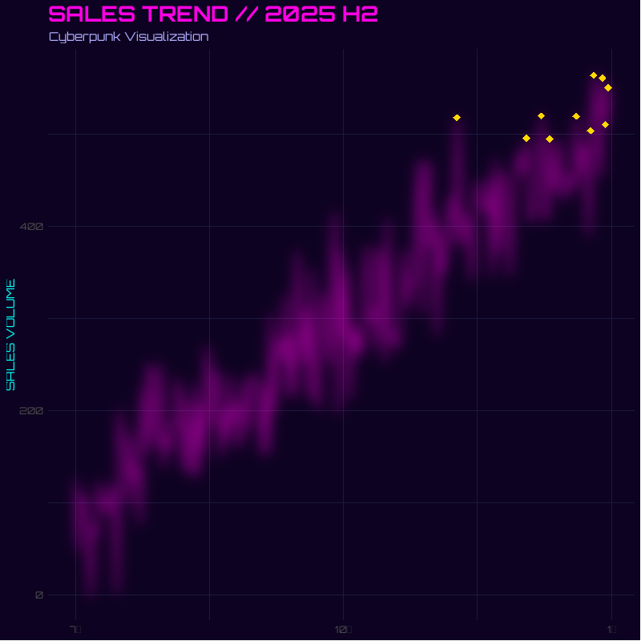

# 第16章 R 第14节 与大模型交互 {.unnumbered}

## 前言

R 与大模型的交互方式已相当成熟，形成了从**统一接口包**、**特定提供商客户端**到**本地模型集成**、**智能体框架**与**检索增强生成（RAG）** 的完整生态。

**核心交互方式概览**

| 交互方式 | 代表包 | 核心定位 |
|------------------------|------------------------|------------------------|
| **统一接口** | `ellmer`、`tidyllm`、`LLMR` | 一套代码适配多家模型提供商 |
| **专用客户端** | `openai`、`gemini.R`、`llm.api` | 针对单一提供商的深度集成 |
| **本地模型** | `ollamar`、`rollama`、`llamaR` | 在本地运行开源模型，无需 API 密钥 |
| **智能体/工具调用** | `corteza`、`agenticr`、`LLMAgentR` | 让模型调用 R 函数、执行代码 |
| **RAG/嵌入** | `ragnar`、`RAGFlowChainR`、`ragR` | 检索增强生成，结合私有知识库 |

### 1.统一接口包

统一接口包的核心价值在于**将提供商差异封装在配置层**，研究代码无需因更换模型而重写。

**`ellmer`（Posit/tidyverse 出品）** 是目前最主流的方案，支持 OpenAI、Anthropic Claude、Google Gemini、Azure、AWS Bedrock、Databricks、Snowflake 等众多提供商。使用方式极为简洁。

`ellmer` 还提供了 `live_console()` 和 `live_browser()` 用于交互式对话，以及 `chat()` 方法用于在脚本中程序化调用。值得留意的是，`chat_anthropic()` 默认使用 Claude Sonnet 系列模型，该模型在生成 R 代码方面表现突出。

**`tidyllm`** 则采用了 tidyverse 风格的“动词 + 提供商”语法。0.3.0 版本后，`chat()`、`embed()`、`send_batch()` 等通用动词取代了旧的提供商专用函数，提供商通过 `claude()`、`openai()`、`ollama()` 等配置函数指定。它支持多模态输入（图片、PDF、音频/视频），并维护结构化的对话历史。

**`LLMR`** 面向研究场景，采用**单一配置对象**（`llm_config()`）和**单一调用函数**（`call_llm()`）的设计。其特点是内置了对**结构化输出（JSON Schema）** 的一等支持，以及面向多模型实验的并行运行工具 `call_llm_par()`。

### 2.特定提供商客户端

当需要深度使用某一提供商的独有功能时，专用客户端更为合适。

**`openai`** 是 OpenAI API 的完整 R 封装，覆盖 Chat、Embeddings、Images（DALL-E）、Audio（Whisper/TTS）、Fine-tuning 等全部端点。**`openaiRtools`** 则是对 OpenAI Python SDK 的完整移植，API 风格与 Python 版本高度一致。

**`gemini.R`** 提供 Google Gemini API 的全面接口，支持 Gemini 的文本生成、多模态理解以及 TTS（语音合成）功能。

**`llm.api`** 是一个**极简依赖**的客户端，仅依赖 `curl`、`jsonlite` 和 `tinyoauth`，支持 OpenAI、Anthropic Claude、Moonshot Kimi、Ollama 以及任何 OpenAI 兼容端点。它的独特之处在于内置了**智能体循环（agent loop）和工具调用**支持，以及 **Model Context Protocol（MCP）客户端**。

### 3.本地模型集成：Ollama 生态

本地运行大模型在**数据隐私、成本控制和可复现性**方面具有不可替代的优势，尤其适合处理敏感研究数据或需要大规模处理的语料。

**`ollamar`** 是连接 R 与 Ollama 服务器的核心包，提供 `generate()`（单次生成）和 `chat()`（多轮对话）等函数。使用前需在本地安装 Ollama 并拉取模型（如 `ollama pull llama3.1`）。硬件上，运行 7B 模型至少需要 8GB 内存，13B 模型需 16GB，33B 模型需 32GB。

**`rollama`** 在 `ollamar` 的基础上增加了**完整的模型生命周期管理**功能，包括 `check_model_installed()`、`create_model()`（从 Modelfile 创建自定义模型）、`chat_history()` 和 `new_chat()` 等，适合需要精细控制本地模型行为的场景。

**`llamaR`** 则提供了对 `llama.cpp` 的底层 R 绑定，支持通过 `ggmlR` 进行 GPU 加速，适合对推理性能有极致要求的用户。

### 4.智能体与工具调用：让模型操作 R 环境

这是 R 与大模型交互中**最具变革性**的方向――模型不再只是生成文本，而是可以**调用 R 函数、读取会话对象、执行代码并迭代推理**。

**`corteza`** 将工具直接映射为 **R 函数调用**，无需 MCP 服务器，并带有溯源追踪机制。它提供三种入口：命令行 CLI、R 控制台的 REPL 循环（`chat()`），以及面向外部客户端的 MCP 服务器（`serve()`）。

**`agenticr`** 的目标更为直接：让 AI 智能体“住进”R 控制台。用户可以在提示符下混合输入 R 代码、自然语言或斜杠命令。它的一个实用设计是：如果没有配置 API 密钥，会自动通过 Ollama 使用本地的 Qwen3-1.7B 模型，实现零配置启动。

**`LLMAgentR`** 提供了基于图的模块化智能体框架，支持构建代码生成、调试、解释和优化等专用 Agent，兼容 OpenAI、Anthropic、Groq 和 Ollama。

`llm.api` 的 `agent()` 函数也值得关注：它自动处理工具调用的循环，直到模型返回纯文本响应为止，简化了多轮工具交互的实现。

### 5.嵌入与 RAG：让模型访问私有知识

**嵌入（Embeddings）** 是将文本转换为向量表示的过程，是语义搜索和 RAG 的基础。

**`ragnar`（tidyverse 出品）** 提供了统一的嵌入接口，支持 `embed_openai()`、`embed_ollama()`、`embed_bedrock()` 等，目标是让 R 用户能够以一致的方式从主流提供商获取嵌入向量。

**`RAGFlowChainR`** 构建了完整的 RAG 工作流：使用 **DuckDB** 作为本地向量存储，支持 HNSW 索引和全文检索，可对接 OpenAI 或 Ollama 兼容的嵌入模型，并集成了可选的 **Tavily 网络搜索**作为补充检索源。它的设计目标是对标 Python 生态中的 RAGFlowChain，为 R 用户提供生产级的 RAG 管道。

**`ragR`** 则更侧重于 RAG 工作流的**构建、运行、日志记录和评估**，使用本地 RDS 文件作为向量存储，适合需要轻量级、完全本地化方案的场景。

**`text2vec`** 是一个历史悠久的文本向量化包，支持 GloVe 词嵌入、LDA/LSA 主题建模等经典方法，适合不依赖外部 API 的纯本地嵌入需求。

## 一、ellmer 包

`ellmer` 是 Posit 团队为 R 语言打造的 LLM 统一接口包，它让 R 用户能用一套语法调用十余种大模型，并无缝融入数据分析工作流。

## 1.核心功能概览

-   **统一的多模型接口**：`ellmer` 通过 `chat_*()` 系列函数屏蔽了不同厂商 API 的差异，覆盖 OpenAI、Anthropic Claude、Google Gemini、DeepSeek、Ollama 等主流服务商。切换模型只需更换函数名，代码其余部分几乎不变。

-   **流式输出（Streaming）**：支持逐字逐句接收回复，在控制台或 Shiny 应用中都能获得类似 ChatGPT 的实时体验。

-   **工具调用（Tool Calling）**：通过 `tool()` 函数将任意 R 函数注册为“工具”，LLM 可在对话中自动请求调用，实现查询数据库、执行计算、获取实时信息等操作。

-   **结构化数据提取**：这是 `ellmer` 最具特色的功能。你只需用 `type_object()` 声明期望的数据结构，调用 `$chat_structured()`，LLM 就会直接从非结构化文本中提取信息，并返回 R 中对应的 list 或 data.frame，无需手动解析 JSON。

-   **异步与并发**：`$chat_async()` 和 `$stream_async()` 返回 Promise 对象，适合批量并行处理大量 LLM 请求，显著提升吞吐效率。

-   **生态协同**：`ellmer` 是 Posit AI 工具链的入口，可与 `vitals`（模型评估）、`ragnar`（RAG）、`shinychat`（Shiny 聊天应用）、`mcptools`（MCP 协议）等包配合使用。

### 2.安装与配置（以DeepSeek为例）

**安装**（CRAN 正式版）：

``` r
install.packages("ellmer")
```

**配置 DeepSeek API Key**：

因为 API key 很敏感，直接写在 R 脚本里容易泄露。官方推荐将密钥写入 `.Renviron` 文件，R 启动时会自动加载，`ellmer` 会自动读取，代码里就不用出现 key。方法如下：

```         
# 如果没安装 usethis
install.packages("usethis")


# 打开 .Renviron 文件
usethis::edit_r_environ()


# 然后在打开的文件里加一行：
DEEPSEEK_API_KEY="你的密钥"


# 保存文件，然后重启 R / RStudio。
# 之后检查：
# Sys.getenv("DEEPSEEK_API_KEY")
# 如果能显示你的 key，就说明设置好了。
# 以后用 ellmer 连接 DeepSeek 时，
# 就不用再手动传密钥，ellmer包会自动读取这个环境变量。
```

### 3.DeepSeek 接口

`chat_deepseek()` 构建在 `chat_openai_compatible()` 之上，默认连接 DeepSeek 官方 API（[`https://api.deepseek.com`](https://api.deepseek.com)）。

``` r
library(ellmer)


chat_deepseek(
  system_prompt = NULL,
  base_url = "https://api.deepseek.com",
  api_key = NULL,
  credentials = NULL,
  model = NULL,
  params = NULL,
  api_args = list(),
  echo = NULL,
  api_headers = character()
)


models_deepseek(
  base_url = "https://api.deepseek.com",
  api_key = NULL,
  credentials = NULL
)
```

根据官方文档，`chat_deepseek()` **目前不支持结构化数据提取（structured data extraction）和图像输入**。如果你的任务依赖 `$chat_structured()` 或 `type_object()`，需要改用 `chat_openai()` 或 `chat_anthropic()` 等支持该功能的模型。

### 4.应用案例：

以下案例改编自 R 语言博士团队的实战演示，完整展示了 `ellmer` + DeepSeek 在真实数据分析场景中的用法。用 DeepSeek 生成赛博朋克风格 ggplot2 图表。

**场景设定：**

你有一份 2025 年下半年的每日销售数据（`trend_data`），包含 `date`、`sales` 和 `is_peak`（是否高峰日）三列。你希望 AI 生成一张**赛博朋克风格**的 `ggplot2` 图表，要求深色背景、霓虹色线条、发光效果和自定义字体。

**完整代码：**

``` r
library(ellmer)
library(tidyverse)


# --- 1. 模拟数据 ---
set.seed(2026)
trend_data <- tibble(
  date = seq(as.Date("2025-07-01"), as.Date("2025-12-31"), by = "day")
) |>
  mutate(
    base_value = seq(100, 500, length.out = n()),
    noise = rnorm(n(), 0, 50),
    sales = pmax(0, base_value + noise),
    is_peak = sales > quantile(sales, 0.95)
  )


# --- 2. 创建 DeepSeek 聊天对象 ---
chat <- chat_deepseek(
  system_prompt = paste(
    "你是一位资深的 R 语言数据可视化专家，精通 tidyverse 和 ggplot2。",
    "你擅长创建视觉冲击力强的图表，并严格遵循用户的数据结构和需求。",
    "生成的代码必须可以直接运行，不要使用未在用户数据中定义的列名。"
  )
)


# --- 3. 构造带有数据上下文的 Prompt ---
prompt <- paste0(
  "我有一个名为 `trend_data` 的数据框，包含以下列：\n",
  "- date (日期，Date 类型)\n",
  "- sales (每日销售额，数值型)\n",
  "- is_peak (布尔值，是否为销售高峰日)\n\n",
  "数据前 6 行如下：\n",
  paste(capture.output(head(trend_data)), collapse = "\n"),
  "\n\n请使用 ggplot2 绘制一张赛博朋克(Cyberpunk)风格的销售趋势图。",
  "具体要求：\n",
  "1. 深色背景（如 #0D0221 或类似深色）\n",
  "2. 使用霓虹色（青蓝、品红、亮紫）作为线条和标注颜色\n",
  "3. 高峰日用醒目的标记高亮\n",
  "4. 添加发光效果（使用 ggfx 包或阴影模拟）\n",
  "5. 标题和轴标签使用科技感字体（如 Orbitron，若不可用则用无衬线字体）\n",
  "6. 输出完整的 R 代码，包含必要的 library() 调用。"
)


# --- 4. 发送请求，获取生成的代码 ---
response <- chat$chat(prompt)
cat(response)
```



**提示词设计：**

-   **System Prompt 的角色约束**：在 `chat_deepseek()` 中通过 `system_prompt` 限定 AI 的角色（“R 可视化专家”）和行为准则（“代码可直接运行”“不捏造列名”），这能显著减少幻觉代码。

-   **数据上下文注入**：将 `head(trend_data)` 的实际输出嵌入 Prompt，让模型“看到”真实的数据结构（列名、类型、样例值），而不是凭空猜测。这是减少列名错误的关键技巧。

-   **Prompt 工程与视觉规格的精确描述**：把“赛博朋克风格”拆解为可执行的具体要求（背景色代码、配色方案、发光效果实现方式、字体名称），让模型有明确的施工图纸。

模型输出：

DeepSeek 会返回类似下面的代码（经过整理）。模型会根据实际数据分布自动调整坐标轴范围、高峰点位置和标注细节，你只需将返回的代码粘贴到 R 脚本中运行即可。

``` r
library(ggplot2)
library(ggfx)   # 用于发光效果
library(showtext)


# 加载字体
font_add_google("Orbitron", "orbitron")
showtext_auto()


ggplot(trend_data, aes(x = date, y = sales)) +
  as_reference(
    geom_line(color = "#00FFF7", linewidth = 0.8),
    id = "line"
  ) +
  with_blur(
    geom_line(color = "#FF00E4", linewidth = 1.2, alpha = 0.6),
    sigma = 8
  ) +
  geom_point(
    data = filter(trend_data, is_peak),
    color = "#FFD700", size = 3, shape = 18
  ) +
  scale_color_manual(values = c("FALSE" = "#00FFF7", "TRUE" = "#FFD700")) +
  labs(
    title = "SALES TREND // 2025 H2",
    subtitle = "Cyberpunk Visualization",
    x = NULL, y = "SALES VOLUME"
  ) +
  theme_minimal(base_family = "orbitron") +
  theme(
    plot.background = element_rect(fill = "#0D0221", color = NA),
    panel.background = element_rect(fill = "#0D0221", color = NA),
    panel.grid = element_line(color = "#1A1A3E", linewidth = 0.2),
    text = element_text(color = "#00FFF7"),
    plot.title = element_text(color = "#FF00E4", size = 20, face = "bold"),
    plot.subtitle = element_text(color = "#B0B0FF", size = 11)
  )
```

### 5.小结

`ellmer` + DeepSeek 的组合在 **代码生成与数据分析辅助**场景中性价比极高：DeepSeek 的 API 价格远低于主流商业模型，而 `ellmer` 的统一接口让整个工作流保持简洁。需要注意的是，由于 `chat_deepseek()` 当前不支持结构化数据提取，若你的任务涉及从文档中批量抽取字段并返回 data.frame，建议将模型切换为 `chat_openai()` 或 `chat_anthropic()`，其余 API 用法完全一致。

## 二、直接通过 HTTP 调用 LLM API

当现有 R 包没有覆盖某个端点（如**智谱大模型GLM系列**），或者你需要更精细地控制请求头、认证方式、超时、重试、流式响应时，可以直接构造 HTTP 请求调用 LLM API。核心流程仍然是：

**构造请求 → 添加认证头 → 设置请求体（通常是 JSON）→ 发送 POST 请求 → 解析响应**

对此 R 中可用的三种方式是：

-   **httr2**：现代、管道友好，推荐首选；
-   **httr**：经典稳定，很多旧代码仍在使用；
-   **curl**：最底层，适合需要完全控制 HTTP 行为的场景。

### 1.httr2：推荐方式

``` r
library(httr2)
library(jsonlite)


req <- request("https://open.bigmodel.cn/api/paas/v4/chat/completions") |>
  req_headers(
    Authorization = paste("Bearer", YOUR_API_KEY),
    `Content-Type` = "application/json"
  ) |>
  req_body_json(list(
    model = "glm-5.3",
    temperature=0.5,
    messages = list(
      list(role = "user", content = "用R写一个线性回归的示例")
    )
  ))


resp <- req_perform(req)
result <- resp_body_json(resp)
cat(result$choices[[1]]$message$content)
```

说明：

-   `request()` 创建请求对象；
-   `req_headers()` 添加认证头和内容类型；
-   `req_body_json()` 自动把 R 列表转成 JSON，并默认设置 `Content-Type: application/json`，也会自动处理标量 `unbox`；
-   `req_perform()` 发送请求；
-   `resp_body_json()` 把响应体解析为 R 列表。

### 2. 更稳健的版本

生产环境中不要只写最小示例，建议至少加上超时、重试和状态码检查。

``` r
library(httr2)
library(jsonlite)


req <- request("https://open.bigmodel.cn/api/paas/v4/chat/completions") |>
  req_headers(
    Authorization = paste("Bearer", YOUR_API_KEY)
  ) |>
  req_body_json(list(
    model = "glm-5.3",
    temperature=0.5,
    messages = list(
      list(role = "system", content = "你是一个严谨但简洁的 R 助手。"),
      list(role = "user", content = "用R写一个线性回归的示例")
    ),
    temperature = 0.2,
    max_tokens = 800
  )) |>
  req_timeout(60) |>
  req_retry(
    max_tries = 3,
    is_transient = function(resp) {
      resp_status(resp) %in% c(429, 500, 502, 503, 504)
    }
  ) |>
  req_error(is_error = function(resp) FALSE)


resp <- req_perform(req)


if (resp_status(resp) >= 400) {
  cat("请求失败，HTTP 状态码：", resp_status(resp), "\n")
  cat(resp_body_string(resp), "\n")
} else {
  result <- resp_body_json(resp, simplifyVector = FALSE)
  cat(result$choices[[1]]$message$content)
}
```

这里的关键点：

-   `req_timeout(60)`：设置 60 秒超时；
-   `req_retry()`：对限流和临时服务器错误进行重试；
-   `req_error(is_error = function(resp) FALSE)`：不让 httr2 自动抛错，方便手动检查状态码和错误体；
-   `simplifyVector = FALSE`：保持嵌套 JSON 的列表结构，便于按字段访问。

### 3. 多轮对话

LLM API 通常通过 `messages` 数组维护上下文：

``` r
messages <- list(
  list(role = "system", content = "你是一个 R 语言专家。"),
  list(role = "user", content = "什么是线性回归？"),
  list(role = "assistant", content = "线性回归是……"),
  list(role = "user", content = "请给出一个 R 示例。")
)


req <- request("https://open.bigmodel.cn/api/paas/v4/chat/completions") |>
  req_headers(Authorization = paste("Bearer", YOUR_API_KEY)) |>
  req_body_json(list(
    model = "glm-5.3",
    messages = messages,
    temperature = 0.3
  ))


resp <- req_perform(req)
result <- resp_body_json(resp)
cat(result$choices[[1]]$message$content)
```

### 4. 调试请求

``` r
req |> req_dry_run()
req |> req_verbose() |> req_perform()
```

也可以检查最后一次请求和响应：

``` r
httr2::last_request()
httr2::last_response()
```

查看响应状态和头：

``` r
resp_status(resp)
resp_headers(resp)
resp_body_string(resp)
```

### 5.httr：经典方式

如果你维护旧代码，或者依赖 httr 生态，可以这样写：

``` r
library(httr)
library(jsonlite)


body <- list(
  model = "glm-5.3",
  messages = list(
    list(role = "user", content = "用R写一个线性回归的示例")
  )
)


resp <- POST(
  url = "https://open.bigmodel.cn/api/paas/v4/chat/completions",
  add_headers(
    Authorization = paste("Bearer", YOUR_API_KEY)
  ),
  content_type_json(),
  body = toJSON(body, auto_unbox = TRUE),
  encode = "raw"
)


if (status_code(resp) >= 400) {
  stop(content(resp, "text", encoding = "UTF-8"))
}


txt <- content(resp, "text", encoding = "UTF-8")
result <- fromJSON(txt, simplifyVector = FALSE)
cat(result$choices[[1]]$message$content)
```

要点：

-   `toJSON(..., auto_unbox = TRUE)` 很重要，否则单个字符串可能被编码成数组；
-   `content_type_json()` 设置 `Content-Type`；
-   `encode = "raw"` 表示请求体已经是 JSON 字符串；
-   `status_code()` 检查 HTTP 状态码。

### 6.curl：最底层方式

当需要完全控制 HTTP 行为时，可以使用 `curl` 包：

``` r
library(curl)
library(jsonlite)


h <- new_handle()


handle_setheaders(
  h,
  "Authorization" = paste("Bearer", YOUR_API_KEY),
  "Content-Type" = "application/json"
)


body <- toJSON(list(
  model = "glm-5.3",
  messages = list(
    list(role = "user", content = "用R写一个线性回归的示例")
  )
), auto_unbox = TRUE)


handle_setopt(h, postfields = body)


con <- curl("https://open.bigmodel.cn/api/paas/v4/chat/completions", handle = h)


txt <- paste(readLines(con, warn = FALSE), collapse = "\n")
close(con)


result <- fromJSON(txt, simplifyVector = FALSE)
cat(result$choices[[1]]$message$content)
```

这种方式适合：

-   自定义端点；
-   非标准认证；
-   调试代理、TLS、HTTP 版本；
-   需要精确控制底层连接行为。

## 7.非标准端点与认证

不同厂商的 API 并不完全兼容 OpenAI。例如 Anthropic Claude 使用 `x-api-key` 和 `anthropic-version`，端点和请求体也不同：

``` r
library(httr2)


req <- request("https://api.anthropic.com/v1/messages") |>
  req_headers(
    `x-api-key` = Sys.getenv("ANTHROPIC_API_KEY"),
    `anthropic-version` = "2023-06-01",
    `content-type` = "application/json"
  ) |>
  req_body_json(list(
    model = "claude-3-5-sonnet-latest",
    max_tokens = 1024,
    messages = list(
      list(role = "user", content = "用R写一个线性回归的示例")
    )
  ))


resp <- req_perform(req)
result <- resp_body_json(resp, simplifyVector = FALSE)
cat(result$content[[1]]$text)
```

很多本地推理服务提供 OpenAI 兼容端点，例如 Ollama、vLLM、LM Studio、LocalAI 等。此时通常只需要改 `base_url`。以本地部署的Ollama为例：

``` r
library(httr2)
library(jsonlite)


base_url <- Sys.getenv("OPENAI_BASE_URL", "http://localhost:11434")
model    <- Sys.getenv("OPENAI_MODEL", "deepseek-r1:8b")


req <- request(base_url) |>
  req_url_path_append("v1", "chat", "completions") |>   # 拼出 /v1/chat/completions
  req_method("POST") |>                                  # 指定 POST
  req_body_json(list(
    model = model,
    messages = list(
      list(role = "user", content = "你好，请介绍一下你自己。")
    )
  ))


resp <- req_perform(req)
result <- resp_body_json(resp, simplifyVector = FALSE)
cat(result$choices[[1]]$message$content)
```

如果本地服务不需要认证，可以不加 `Authorization` 头；如果需要，则按服务要求添加。

## 8.常见问题与最佳实践

-   **密钥不要硬编码，**使用环境变量或 `.Renviron`。

-   **优先使用 httr2。**httr2 的管道风格、重试、错误处理和流式支持更现代。httr 适合旧代码，curl 适合底层调试。

-   **检查 HTTP 状态码。每次**请求不一定成功，400、401、403、429、500 都应有不同处理。

-   **设置超时和重试：**LLM 网络请求可能较慢，加入**`req_timeout(60)`** 和 **`req_retry(max_tries = 3)更稳健`**。

-   **注意 JSON 编码。**使用 httr2 的 `req_body_json()` 通常不需要手动 **`auto_unbox`**。使用 httr 或 curl 时，记得：jsonlite::toJSON(x, **auto_unbox = TRUE**)

-   **处理限流：**遇到 429 时，可以读取 `Retry-After` 响应头，或者使用指数退避。

-   **不要泄露密钥：**调试时避免打印完整请求头。`req_dry_run()` 会尽量隐藏敏感信息，但仍需谨慎。

-   **代理与网络环境：**可以通过 `req_proxy()` 或环境变量设置代理：

    ``` r
    req |> req_proxy("http://proxy.example.com", 8080)
    ```

-   **成本与输出长度控制：**设置 `max_tokens`、`temperature` 等参数，避免意外消耗。

-   **生产环境建议封装：**把 base URL、模型名、认证方式、超时、重试、错误解析封装成函数，避免每次重复写请求代码。

总之，直接通过 HTTP 调用 LLM API 的最大优势是灵活：你可以访问任何端点、使用任何认证方式、调试任何请求细节。

## 三、Ollama

**Ollama** 是一款开源的本地大语言模型（LLM）运行平台，它的核心目标是**让大模型像 Docker 容器一样，可以在个人电脑上一键下载、运行和管理**。它极大地降低了本地运行大模型的门槛，让你无需依赖云端 API，即可在本地离线使用 DeepSeek、Qwen、Llama 等上百个开源模型。

### 1.核心优势

Ollama 解决了传统云端 AI 服务的几大痛点，为用户提供了更灵活、自主的 AI 使用方式。

-   **完全免费与开源**：Ollama 本身及其支持的模型均免费，采用 MIT 许可证，你可以无限制地使用，无需支付任何 API 调用费用。
-   **数据隐私与安全**：所有数据处理都在本地完成，输入和输出不会离开你的设备，从根本上杜绝了数据被第三方收集或滥用的风险，尤其适合处理敏感信息。
-   **离线可用与灵活部署**：模型下载后，可在无网络环境下运行。你还可以将 Ollama 安装在局域网内的服务器上，实现多设备共享使用，甚至能在树莓派等低功耗设备上运行。
-   **丰富的模型库与灵活切换**：支持超过 **150 个**开源模型，包括 Llama、DeepSeek、Qwen、Mistral、Gemma 等，你可以根据需求轻松切换不同模型。

### 2.模型库

Ollama 通过 `ollama.com/library` 维护一个经过本地推理优化的模型库，覆盖主流开源模型家族：

| 模型家族  | 代表模型                    | 特点                             |
|-----------|-----------------------------|----------------------------------|
| Llama     | Llama 2 / 3 / 3.1 / 3.2 / 4 | Meta 的通用模型系列              |
| Gemma     | Gemma 1 / 2 / 3             | Google 的高效语言模型            |
| Qwen      | Qwen 2 / 3 / 2.5-VL / 3-VL  | 阿里巴巴的模型家族，含多模态变体 |
| Mistral   | Mistral 1/2/3、Mixtral      | Mistral AI 的模型                |
| DeepSeek  | DeepSeek v3.1、R1           | 推理模型                         |
| Phi       | Phi 系列                    | 微软的小型语言模型               |
| CodeLlama | ―                           | 代码生成专用                     |

模型命名遵循结构化格式：`[host/][namespace/]model[:tag]`，例如 `registry.ollama.ai/library/llama3:8b`。

**标签（tag）** 用于标识模型版本、参数量或量化级别（如 `7b`、`q4_0`、`q8_0`），`q4_0` 比 `q8_0` 节省约 50% 显存。

### 3.工具链与框架集成

Ollama 生态最显著的特征是**与主流 AI 应用框架的深度互操作**。

**LangChain 集成**：`langchain-ollama`（Python）和 `@langchain/ollama`（JS）是两个官方维护的集成包。以 JS 版本为例，实例化 `ChatOllama` 时指定模型名称即可直接调用本地模型，默认连接 `http://localhost:11434`。Python 侧则可以通过 `langchain_community.llms.Ollama` 或使用 OpenAI 兼容协议接入。

**MCP（Model Context Protocol）支持**：Ollama 与 MCP 的结合使本地模型能够调用外部工具。社区已有多个 MCP 服务器实现，支持 GitHub API 集成、浏览器自动化、多智能体端点等功能。例如，一个 GitHub Bot 可以接收 PR 变更，将 diff 发送给本地 Ollama 模型进行审查，再把评审结果作为评论发回仓库。

**RAG 与向量数据库**：Ollama 常作为 RAG 系统的生成端，配合 Qdrant、ChromaDB、FAISS 等向量数据库使用。典型流程包括：使用 `nomic-embed-text` 等嵌入模型生成向量→存入向量数据库→检索时由 Ollama 接收检索到的上下文并生成回答。

### 4.技术架构

Ollama 采用了经典的 **Client-Server（客户端-服务器）架构**，通过模块化设计将复杂性封装在底层。

-   **核心组件**：其架构自下而上可分为三层：
    -   **推理引擎层**：底层依赖 **`llama.cpp`**，这是一个用 C/C++ 编写的高性能推理引擎，负责最繁重的模型加载和矩阵计算工作。
    -   **服务层**：Ollama 服务器通过 HTTP 协议与客户端通信，并对外提供 **OpenAI 兼容的 API** 接口，这意味着大量现有的 AI 应用和工具可以无缝对接 Ollama。
    -   **客户端层**：用户通过命令行（CLI）或桌面应用与 Ollama 交互，发起模型加载、对话等请求。
-   **关键技术：量化（Quantization）**：Ollama 默认拉取的是 **Q4_K_M 量化版**模型。通过将模型权重从 16-bit 压缩到约 4-bit，可将模型体积缩小至原大小的 **1/3**，从而让 14B 参数的大模型能够在仅 32GB 内存的家用电脑上流畅运行。

### 5.官方接口与 SDK

Ollama 提供**三个层级的接入方式**，覆盖从快速调试到深度集成的全部需求：

**REST API**：服务默认监听 `127.0.0.1:11434`，通过 `curl` 即可直接调用，无需额外依赖。

**官方 Python / JavaScript SDK**：处理认证、流式传输、错误处理和类型安全接口。Python 库提供 `generate` 和 `chat` 两种调用模式，支持上下文管理（通过 `context` 参数保持多轮对话）和请求取消。JavaScript 库同时支持 Node.js 和浏览器环境，内置完整的 TypeScript 类型定义。

**OpenAI API 兼容层**：Ollama 提供了 `/v1/chat/completions` 兼容端点，现有基于 OpenAI 的应用只需将 `base_url` 指向 `http://localhost:11434/v1/`，`api_key` 填入任意占位值即可无缝迁移。

此外，社区维护的 SDK 覆盖了 .NET、Java 等语言，例如基于 OpenAPI 规范自动生成的 C# SDK 支持全部 Ollama API 端点。

### 6.核心功能

Ollama 提供了一套完整的工具链，方便你管理和定制模型。

-   **简化的模型管理**：通过简单的命令即可完成模型的拉取、运行、查看和删除。

    ``` bash
    # 下载并运行一个模型
    ollama run qwen2.5:7b


    # 查看本地已下载的模型列表
    ollama list


    # 删除一个模型
    ollama rm qwen2.5:7b
    ```

-   **强大的 Modelfile 定制**：`Modelfile` 是 Ollama 的“蓝图”，允许你创建和分享自定义模型。你可以通过它设置系统提示词（System Prompt）、调整运行参数（如温度、top_p），甚至导入 GGUF 或 Safetensors 格式的自定义模型。

-   **多语言 API 与生态集成**：除了 REST API，Ollama 还提供了 **Python** 和 **JavaScript** 库。其 **OpenAI 兼容接口**（`/v1/chat/completions`）让你可以直接使用 OpenAI 的 SDK 来调用本地模型，只需将 `base_url` 指向 http://localhost:11434/v1/chat/completions 即可。

### 7.硬件要求与安装

Ollama 支持 **macOS、Windows 和 Linux** 三大平台，安装过程非常简单，通常只需下载安装包并一路“下一步”即可。

-   **最低配置（可运行 7B 模型）**：4 核 CPU + 8GB 内存。
-   **推荐配置（流畅运行 13B+ 模型）**：8 核 CPU + 16GB 内存 + NVIDIA 显卡（支持 CUDA）。
-   **GPU 支持**：Ollama 支持计算能力 **5.0+** 的 NVIDIA GPU（驱动版本 531+），以及通过 ROCm 库支持的 AMD GPU。在 Apple Silicon Mac 上，它还能利用 **MLX** 框架进行加速。

### 8.安全注意事项

Ollama 默认配置存在**未授权访问风险**：服务默认暴露 RESTful API 端口 11434，缺乏内置身份验证。2025 年 3 月，国家网络安全通报中心曾就此发出通报。

社区和官方建议的**加固措施**包括：保持服务绑定在 `127.0.0.1`、通过 Caddy 反向代理添加 HTTP Basic Auth、启用 TLS 加密 API 通信、以及通过 OAuth2.0 实现基于角色的访问控制。Ollama 社区也在推动“Secure Mode”特性，计划通过 `--secure` 标志切换至加固默认配置，包括内置认证和启动时的安全警告。

**默认情况下，Ollama 服务仅绑定到本地 `127.0.0.1`，是安全的。** 但许多教程会指导用户设置 `OLLAMA_HOST=0.0.0.0` 以便局域网访问，**这会使服务暴露在网络上且没有任何鉴权机制**，存在未授权访问的风险。

如需远程访问，务必通过 **Nginx 反向代理**并添加 **HTTP Basic Auth** 认证，或使用 **Cloudflare 隧道**等安全方式，切勿直接将 Ollama 端口暴露在公网。

### 9.生态定位

在与同类工具的对比中，Ollama 的定位非常清晰：

-   **Ollama**：**个人开发与快速原型**的首选，强调开箱即用的体验和简化的模型管理。 \*

-   **llama.cpp**：追求**极致性能与硬件适配**的底层引擎，适合在边缘设备上进行高度定制化的部署。

-   **vLLM**：面向**生产环境的高并发服务**框架，适合需要处理大量并发 API 请求的场景。

总的来说，Ollama 是个人开发者、研究者和 AI 爱好者体验和部署本地大模型的**最佳起点**。它通过极简的交互和强大的功能，将原本复杂的本地 AI 部署变成了像安装普通软件一样简单的事情。

## 四、与Ollama交互

在R语言中与Ollama交互，最直接的方式是使用**专门的R包**。它们封装了底层的HTTP请求，让你能像调用普通R函数一样使用本地大模型。目前社区最主流的选择是 **`ollamar`** 和 **`rollama`**。

### 1.主流R包速览

| R包 | 核心特点 | 适用场景 |
|:-----------------------|:-----------------------|:-----------------------|
| **ollamar** | 功能全面，与Ollama官方Python/JS库风格相似，返回`httr2`对象，便于调试。 | 需要精细控制请求、进行并行化操作或希望与官方库体验一致的开发者。 |
| **rollama** | 封装了Ollama API，提供类似ChatGPT的对话体验，支持`query`（单次问答）和`chat`（多轮对话）函数。 | 快速进行多轮对话交互，或希望以更简洁的方式管理对话历史。 |
| **ellmer** | Tidyverse风格，提供`chat_ollama()`函数，统一的聊天接口，自动处理对话状态。 | 已经习惯使用Tidyverse系列包，希望用统一方式与多种LLM交互的用户。 |
| **tidyllm** | 提供Tidy风格的管道操作，可无缝集成到数据工作流中。 | 在数据管道中批量处理LLM请求，或需要与云端模型混合使用的场景。 |
| **shiny.ollama** | 提供开箱即用的R Shiny图形界面，无需编码即可与模型聊天。 | 希望快速拥有一个本地聊天界面，或需要构建交互式AI应用原型的用户。 |

### 2.快速上手：以 `ollamar` 为例

**1. 安装与准备** 首先安装并启动Ollama，然后在R中安装`ollamar`包：

``` r
# 从CRAN安装稳定版
install.packages("ollamar")
```

**2. 核心操作示例**

``` r
library(ollamar)


# 测试连接（确保Ollama服务已启动）
test_connection()


# 列出本地已下载的模型
list_models()


# 下载一个新模型
pull("llama3.1")


# 生成文本（返回httr2响应对象）
resp <- generate("llama3.1", "用一句话解释什么是R语言。")
# 提取文本结果
resp_process(resp, "text")
```

### 3.其他包的简单用法

**`rollama` 的多轮对话**

``` r
library(rollama)


# 单次问答
query("为什么天空是蓝色的？")


# 开启多轮对话，自动保留上下文
chat("为什么天空是蓝色的？")
chat("那你怎么知道的？")
```

`rollama` 的 `chat()` 函数会自动维护对话历史，直到你调用 `new_chat()` 开始新会话。

**`ellmer` 的Tidyverse风格**

``` r
library(ellmer)


# 创建聊天对象
chat <- chat_ollama(model = "llama3.2")
# 开始对话
chat$chat("给我讲三个关于统计学家的笑话")
```

**`shiny.ollama` 一键启动图形界面**

``` r
library(shiny.ollama)
# 启动内置的Shiny聊天应用
run_app()
```

执行后会打开一个网页界面，你可以在其中选择模型并进行对话。

### 4.选择建议

选择哪个包取决于你的具体需求：

-   **追求功能全面和官方体验**：首选 **`ollamar`**。

-   **快速开始多轮对话**：**`rollama`** 的 `chat()` 函数非常便捷。

-   **融入Tidyverse工作流**：**`ellmer`** 或 **`tidyllm`** 是不错的选择。

-   **需要图形界面**：直接用 **`shiny.ollama`** 启动应用。

此外，Ollama本身提供兼容OpenAI的API，你也可以直接用 `httr2` 等包发送POST请求到 [`http://localhost:11434/v1/chat/completions`](http://localhost:11434/v1/chat/completions)，实现更底层的自定义交互，前文已经做出介绍。

## 五、rollama

`rollama` 是一个 R 语言包，旨在封装 Ollama 的 API，让你能在 R 环境中无缝运行本地大语言模型，获得类似使用 ChatGPT/OpenAI API 的体验。它的设计哲学是**以本地、开源权重的模型为核心，优先考虑隐私、可复现性和科研任务的易用性**。

### 1.安装与准备

`rollama` 本身只是客户端，你需要先安装 **Ollama 服务**并确保其运行。

**1. 安装 Ollama 服务** 从 [Ollama 官网](https://ollama.com/) 下载并安装。

**2. 安装 `rollama` 包** 在 R 中从 CRAN 安装稳定版，或从 GitHub 安装开发版：

``` r
# 从 CRAN 安装
install.packages("rollama")


# 或安装开发版（更新更频繁）
# install.packages("remotes")
# remotes::install_github("JBGruber/rollama")
```

**3. 验证连接** 安装后，测试 R 能否连接到本地 Ollama 服务：

``` r
library(rollama)
ping_ollama()
# 成功会返回：�7�4 Ollama (v0.17.4) is running at http://localhost:11434!
```

**4. 下载模型** 使用 `pull_model()` 下载模型，不指定参数时下载默认的 `llama3.1:8b`：

``` r
# 下载默认模型
pull_model()


# 下载指定模型
pull_model("qwen2.5:7b")


# 列出本地已有模型
list_models()
```

### 2.核心功能：两种对话模式

`rollama` 提供了 `query()` 和 `chat()` 两个核心函数，分别对应单次问答和多轮对话。

**`query()`：单次问答** 每次调用都是独立请求，模型不保留历史对话。

``` r
# 提出独立问题
query("用一句话解释什么是R语言。")


# 保存结果并提取纯文本
resp <- query("为什么天空是蓝色的？")
answer <- resp$message$content
```

`output` 参数可控制返回格式，如 `"text"`（纯文本）、`"data.frame"`（数据框）、`"list"`（列表）等。

**`chat()`：多轮对话** 自动维护对话上下文，直到调用 `new_chat()` 开始新会话。

``` r
# 开始多轮对话
chat("为什么天空是蓝色的？")
chat("那你怎么知道的？")   # 模型记得上一个问题


# 查看对话历史
chat_history()


# 清空历史，开启新对话
new_chat()
```

### 3.进阶用法

#### 3.**1.全局选项设置**

通过 `options()` 可设置默认行为，避免每次调用都重复指定：

``` r
# 更改默认模型
options(rollama_model = "qwen2.5:7b")    
# 设置随机种子，保证结果可复现
options(rollama_seed = 42)
# 指定服务器地址
options(rollama_server = "http://localhost:11434")
# 默认系统消息
options(rollama_config = "You make answers understandable to a 5 year old")  
```

`rollama_verbose = TRUE`（默认）会显示进度指示器，调试时可设为 `FALSE` 获得更清晰的错误追踪。

#### 3.**2.调整模型参数**

通过 `model_params` 参数临时调整模型行为，如控制随机性（`temperature`）或限制输出长度（`num_predict`）：

``` r
query("写一首关于春天的短诗",
      model_params = list(temperature = 0.9, num_predict = 100))
```

#### 3.**3.自定义模型（Modelfile）**

使用 `create_model()` 基于现有模型创建定制模型，持久化保存系统提示和参数：

``` r
# 创建一个名为 "mario" 的模型
create_model("mario",
             modelfile = "FROM llama3.1\nSYSTEM You are mario from Super Mario Bros.")


# 使用自定义模型
chat("你好，你是谁？", model = "mario")
```

### 4.结构化输出（JSON）

`rollama` 支持强制模型返回符合指定 JSON Schema 的结构化数据，适合需要自动化解析的场景。Ollama 使用**约束解码**技术，确保输出**始终**是符合 Schema 的有效 JSON。

**定义 Schema** `create_schema()` 函数通过组合类型声明来构建 Schema：

| `rollama` 函数      | R 对应类型  | JSON Schema 类型     |
|:--------------------|:------------|:---------------------|
| `type_string()`     | character   | `"string"`           |
| `type_boolean()`    | logical     | `"boolean"`          |
| `type_integer()`    | integer     | `"integer"`          |
| `type_number()`     | double      | `"number"`           |
| `type_enum(values)` | factor      | `"string"` with enum |
| `type_array(items)` | vector/list | `"array"`            |
| `type_object(...)`  | named list  | `"object"`           |

**示例：提取国家信息**

``` r
country_schema <- create_schema(
  name = type_string(description = "Name of the country"),
  capital = type_string(description = "Name of the capital"),
  population = type_number(description = "Number of inhabitants"),
  continent = type_enum(values = c("Asia", "Africa", "North America",
                                     "South America", "Antarctica", "Europe", "Oceania")),
  nato_member = type_boolean(),
  official_languages = type_array(items = type_string())
)


# 将 Schema 传入 format 参数
input_text <- "Canada is a country in North America. With a population of over 41 million..."
query(input_text, format = country_schema)
```

模型会从文本中自动填充所有字段，返回可直接解析的 JSON。

### 5.图像标注（多模态模型）

`rollama` 支持多模态模型（如 `llava`），可以同时处理文本和图像输入。

``` r
# 对图像提问
query("描述这张图片",
      model = "llava",
      images = "https://raw.githubusercontent.com/JBGruber/rollama/master/man/figures/logo.png")


# 结合结构化输出进行系统化图像分类
# 将 images 作为列表传入，可分别标注每张图片
```

你可以将图像标注与结构化输出结合，实现系统化的图像分类和描述。

### 6.文本标注

`rollama` 特别适合批量文本标注任务。通过设置系统提示，可以让模型以固定格式输出分类结果：

``` r
options(rollama_config = "You assign texts into categories. Answer with just the correct category.")


# 对多条文本进行情感分析
texts <- c("the pizza tastes terrible", "the service is great")
for (text in texts) {
  query(paste0(text, "\ncategories: positive, neutral, negative"))
}
```

这种模式可以轻松集成到 `dplyr::mutate()` 等数据管道中，对成千上万的文本进行批量标注。

### 7.模型管理

`rollama` 提供了一套完整的模型管理函数：

``` r
# 下载模型
pull_model("qwen2.5:7b")


# 列出本地模型
list_models()


# 查看模型详情（包括 Modelfile 配置）
show_model("qwen2.5:7b")


# 复制模型
copy_model("qwen2.5:7b", "qwen2.5-copy")


# 删除模型
delete_model("qwen2.5-copy")
```

### 8.并行与流式输出

**流式输出**：`query()` 和 `chat()` 的 `stream` 参数默认为 `TRUE`，答案会实时打印到屏幕。如需缓存结果，需设置 `stream = FALSE`。

**并行请求**：Ollama 服务本身支持并发处理。你可以在 R 中使用 `purrr::map()` 等函数配合 `rollama` 的请求函数（通过 `output = "httr2_request"` 获取）来实现批量并行调用。

### 9.总结

`rollama` 通过简洁一致的函数设计，将本地大模型的强大能力无缝集成到 R 工作流中。它的核心价值在于**隐私保护、结果可复现以及面向科研任务的易用性**。无论是快速问答、多轮对话、自定义模型，还是批量文本/图像标注和结构化数据提取，`rollama` 都提供了直观的接口。你可以通过 `vignette("rollama")` 查看更详细的教程和示例。

## 六、Embedding

### 1.概念解释

**Embedding** 中文常翻译成**“嵌入”**或**“向量化”**。一句话：**把文字、图片、音频等对象变成一串数字向量，让机器能计算它们之间的语义相似度。**

比如“猫”和“小猫”意思接近，“猫”和“汽车”意思差很远。但计算机不能直接比较文字，于是 embedding 模型把每个词、句子或文档映射成一个高维坐标：

-   “猫” → `[0.2, -1.1, 0.7, ...]`

-   “小猫” → `[0.3, -1.0, 0.6, ...]`

-   “汽车” → `[-2.0, 0.5, 1.2, ...]`

“猫”和“小猫”的向量距离近，“猫”和“汽车”的向量距离远。这样机器就能用数学方式判断“语义像不像”。

从技术上说，Embedding 是一个从离散对象到连续向量空间的映射。向量的维度通常有几百到几千维，比如 768、1536、3072 维。每一维没有直观的人类含义，但整体向量捕捉了语义特征。

常用相似度计算方式是**余弦相似度**：越接近 1，表示越相似；越接近 0，表示越不相关；接近 -1，表示方向相反。

### 2.选择并下载嵌入模型

在 `rollama` 中做 Embedding，核心是使用 `embed_text()` 函数，并搭配一个专门的嵌入模型（如 `nomic-embed-text`）。

嵌入任务需要使用专门的嵌入模型，而不是对话模型。`llama3` 等对话模型虽然也能生成向量，但效果和效率都不如专用模型。

**推荐模型**：

-   **`nomic-embed-text`**：最流行、平衡性最好的选择，生成 **768** 维向量，体积约 **274MB**。

-   **`mxbai-embed-large`**：质量更高，生成 **1024** 维向量，体积约 **669MB**。

-   **`all-minilm`**：极致轻量，生成 **384** 维向量，体积仅 **45MB**，适合资源受限场景。

-   **`qwen3-embedding`**：如果追求最新最强性能，可选此系列（如 `:0.6b` 或 `:8b`）。

**下载模型**：

``` r
# 推荐使用 nomic-embed-text
pull_model("nomic-embed-text")
```

### 3.核心函数：`embed_text()`

`rollama` 通过 `embed_text()` 函数将文本转换为数值向量。

``` r
embed_text(
  text,                     # 字符向量，需要生成嵌入的文本
  model = NULL,             # 嵌入模型名称，默认使用 rollama_model 选项
  server = NULL,            # Ollama 服务器地址
  model_params = NULL,      # 额外的模型参数
  verbose = getOption("rollama_verbose", default = interactive())
)
```

**返回值**是一个 **tibble**，其中**每一行对应一个输入文本**，**每一列对应嵌入向量的一个维度**。例如，使用 `nomic-embed-text` 处理 3 条文本，会得到一个 3 行 × 768 列的 tibble。

### 4.完整示例：生成文本嵌入

``` r
library(rollama)


# 1. 准备文本
texts <- c(
  "Here is an article about llamas...",
  "R is a language and environment for statistical computing and graphics.",
  "The quick brown fox jumps over the lazy dog."
)


# 2. 生成嵌入（指定使用 nomic-embed-text 模型）
embeddings <- embed_text(texts, model = "nomic-embed-text")


# 3. 查看结果
print(embeddings)
# 输出是一个 tibble，3 行，768 列（dim_1 到 dim_768）
# 每行代表一个文本的 768 维向量表示
```

### 5.高级用法：在分类任务中使用嵌入

生成嵌入后，你可以将其用于下游任务，如分类或聚类。

``` r
library(rollama)
library(tidymodels)  # 用于建模


# 假设有一个训练数据框 train_df，包含 text 和 rating 两列
# 为所有训练文本生成嵌入
train_embeddings <- embed_text(train_df$text, model = "nomic-embed-text")


# 将嵌入与标签合并，用于训练分类器
train_data <- bind_cols(train_df, train_embeddings)


# 使用随机森林等模型进行训练（此处为示意）
rf_spec <- rand_forest(mode = "classification") %>% set_engine("ranger")
rf_fit <- rf_spec %>% fit(rating ~ ., data = train_data)


# 为新文本生成嵌入
new_embeddings <- embed_text(new_texts, model = "nomic-embed-text")


# 使用训练好的模型进行预测
predictions <- predict(rf_fit, new_data = new_embeddings)
```

### 6.关键技巧与注意事项

-   **务必使用专用嵌入模型**：默认的对话模型（如 `llama3.1`）虽可用，但专用模型在速度、向量质量和维度效率上均有明显优势。
-   **向量已归一化**：Ollama 的 `/api/embed` 端点默认返回 **L2 归一化**（单位长度）向量，可直接用于余弦相似度计算。你无需手动归一化，这与某些其他 API 的行为不同。
-   **批量处理**：`embed_text()` 原生支持批量处理，一次性传入多个文本即可，效率远高于循环单条调用。
-   **模型维度是固定的**：每个嵌入模型输出的向量维度是固定的（如 `nomic-embed-text` 为 768 维），无法通过参数调整。选择模型时需确认其维度是否符合后续用途。
-   **会话级默认模型**：如果经常使用同一个嵌入模型，可以设置全局选项，避免每次调用都指定 `model` 参数： `r     options(rollama_model = "nomic-embed-text")`

## 七、语义距离

语义距离的计算和模型选择通常遵循一个清晰的流程：**文本 → 向量化（Embedding）→ 计算距离**。前文中我们用 `rollama` 完成了第一步，接下来就是如何计算距离和选择合适模型。

### 1.第一步：语义距离的核心计算方法

将文本转化为向量后，衡量它们“语义距离”的常用指标有以下几种：

-   **余弦相似度 (Cosine Similarity)**：最常用的指标，计算两个向量夹角的余弦值。它只关注方向，不关心长度，非常适合文本数据。值域为 `[-1, 1]`，越接近 `1` 表示语义越相似。对应的**余弦距离**为 `1 - 余弦相似度`。
-   **欧几里得距离 (Euclidean Distance)**：计算向量空间中的直线距离。值越小，表示越相似。但它受向量长度影响较大，在文本任务中不如余弦相似度常用。
-   **点积 (Dot Product)**：计算两个向量的内积。如果向量已经**L2归一化**（如Ollama默认输出），点积的结果等同于余弦相似度。
-   **其他距离**：包括曼哈顿距离 (Manhattan)、闵可夫斯基距离 (Minkowski) 等，可根据具体场景选择。

### 2.第二步：在R中实现距离计算

在R中，计算嵌入向量距离的方法非常灵活，你可以直接使用基础函数，也可以借助专门的R包。

#### 2.1.方法一：使用 `rollama` 与基础R函数

这是最直接的方式，你只需将 `rollama` 生成的嵌入向量（tibble格式）转换为矩阵，然后手动计算。

``` r
library(rollama)
library(dplyr)


# 1. 生成嵌入
embeddings_tbl <- embed_text(texts, model = "nomic-embed-text")
embeddings_mat <- as.matrix(embeddings_tbl)


# 2. 计算余弦相似度矩阵 (使用基础R函数)
# 归一化向量
norm_vec <- function(x) {x / sqrt(sum(x^2))}
normalized_embeddings <- t(apply(embeddings_mat, 1, norm_vec))


# 计算余弦相似度矩阵
cosine_sim_matrix <- normalized_embeddings %*% t(normalized_embeddings)


# 3. 转换为余弦距离矩阵
cosine_dist_matrix <- 1 - cosine_sim_matrix
```

#### 2.2.方法二：使用 `text2vec` 包

`text2vec` 提供了高效的 `sim2()` 函数，可以方便地计算相似度矩阵。

``` r
library(text2vec)


# 假设 embeddings_mat 是已经生成的向量矩阵
# 计算文档间的余弦相似度矩阵
doc_sim_matrix <- sim2(
  x = embeddings_mat,
  method = "cosine",
  norm = "l2"
)
```

#### 2.3.方法三：使用专用包进行语义距离分析

对于更复杂的语义距离分析任务，一些R包提供了封装好的函数：

-   **`SemanticDistance` 包**：专门用于计算语言样本中不同元素或块之间的**成对余弦语义距离**，支持对话、独白等多种文本结构的分析。
-   **`text` 包**：提供了 `textDistance()` 和 `textSimilarity()` 函数，可以直接在嵌入向量上计算多种语义距离或相似度。
-   **`conText` 包**：提供了基于余弦相似度寻找**最近邻 (Nearest Neighbors)** 的功能，适合语义搜索和检索任务。

### 3.第三步：嵌入模型的选择指南

嵌入模型的选择直接决定了语义距离计算的准确性和效率。选择时，可以遵循以下决策框架：

#### 3.1.明确核心任务与语言

-   **通用对话与文本理解**：`nomic-embed-text` 或 `mxbai-embed-large` 在通用场景下表现均衡。
-   **中文任务**：优先考虑 **`bge-large-zh`** 或 **`bge-m3`**，它们在中文语义理解和专业术语处理上表现更优。
-   **代码检索**：需要使用在代码库上专门训练的模型，如 **`jina-embeddings-v2`** 或 **`Qwen3-Embedding`** 系列。
-   **多语言场景**：`multilingual-e5-large` 或 `paraphrase-multilingual-MiniLM` 等模型支持上百种语言。

#### 3.2.权衡模型维度与性能

嵌入向量的维度直接影响了存储、计算成本和语义表达能力。

| 维度范围 | 特点 | 适用场景 |
|:-----------------------|:-----------------------|:-----------------------|
| **384 - 768 维** | 体积小，推理和搜索速度快，但语义深度可能有限。 | 对速度要求高、资源受限的场景，如移动端或实时应用。 |
| **1024 - 1536 维** | 在表达能力和效率之间取得较好平衡，是多数通用模型的默认维度。 | 大多数通用语义搜索、分类和聚类任务。 |
| **2048+ 维** | 语义信息最丰富，能捕捉更细微的语义差别，但占用内存大，搜索速度慢。 | 对精度要求极高的科研或专业领域任务。 |

`all-MiniLM-L6-v2`（384维）是一个经典的高效模型，常被作为默认选择。

### 4.完整工作流示例

综合以上步骤，一个完整的语义距离计算流程如下：

``` r
# 1. 加载包
library(rollama)
library(dplyr)
library(tidyr)


# 2. 准备文本数据
texts <- c("The cat sat on the mat", "A dog is playing in the park", "R is a programming language")


# 3. 生成嵌入向量 (使用rollama)
embeddings_tbl <- embed_text(texts, model = "nomic-embed-text")
embeddings_mat <- as.matrix(embeddings_tbl)


# 4. 计算余弦相似度矩阵 (使用基础R函数)
norm_vec <- function(x) x / sqrt(sum(x^2))
normalized_emb <- t(apply(embeddings_mat, 1, norm_vec))
cosine_sim_matrix <- normalized_emb %*% t(normalized_emb)


# 5. 格式化为可读的相似度表格
similarity_df <- as.data.frame(cosine_sim_matrix)
colnames(similarity_df) <- rownames(similarity_df) <- texts
print(similarity_df)


# 6. 找到与特定文本最相似的内容
target_text <- "The cat sat on the mat"
similarities <- similarity_df[target_text, ]
print(similarities)
```

计算语义距离时，**余弦相似度**是首选。模型选择需要综合考虑**任务语言、精度和效率**。你可以用 `rollama` 快速生成嵌入，再用基础R函数或 `text2vec` 等包进行高效的距离计算。
