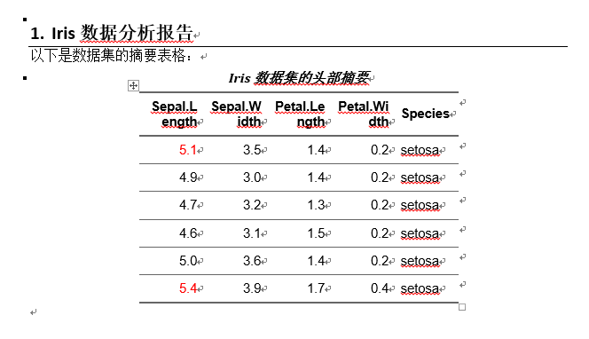

# 第16章 R 第16节 其它常用工具包 {.unnumbered}

## 前言

## 一、conflicted

`conflicted` 是一个用于优化 R 语言中函数名冲突解决策略的包，由 Hadley Wickham 开发。它的核心理念是**将隐性的冲突暴露为显性错误，强制开发者做出明确选择**，从而避免因意外调用错误函数而引发的隐蔽 bug。

### 1.为什么要用 conflicted？

R 的默认冲突解决规则是**“后来者居上”**――当多个包导出了同名函数时，最后加载的包中的函数会覆盖前面的。这种规则的问题在于：

-   **冲突难以察觉**：你可能以为在调用 `dplyr::filter()`，实际上却在调用 `stats::filter()`，代码运行结果错误但不会报错。
-   **包更新可能引入新冲突**：一个原本正常的包在更新后可能新增了与已加载包同名的函数，导致之前能运行的代码突然行为异常。

`conflicted` 将这种“静默覆盖”变为“主动报错”，迫使你明确指定要使用哪个函数。

### 2.安装与加载

``` r
# 从 CRAN 安装
install.packages("conflicted")


# 或使用 pak 从 GitHub 安装开发版
pak::pak("r-lib/conflicted")
```

使用时**只需加载该包**，无需其他配置。建议将其加载在脚本的靠前位置：

``` r
library(conflicted)
library(dplyr)   # 加载后若存在冲突，调用时会报错
```

### 3.核心函数

#### 3.1.`conflicts_prefer()`：声明全局偏好

这是最常用的函数，用于声明在某个函数名冲突时，你希望优先使用哪个包的版本。支持一次性声明多个偏好。

``` r
# 声明单个偏好：让 dplyr 的 filter 优先于所有其他包的 filter
conflicts_prefer(dplyr::filter)


# 一次性声明多个偏好
conflicts_prefer(
  dplyr::filter,
  dplyr::lag,
  lubridate::week
)
```

声明后，再次调用 `filter()` 时会自动使用 `dplyr` 版本，不再报错。

#### 3.2.`conflict_prefer()`：旧版偏好声明

这是 `conflicts_prefer()` 的前身，仍然可用，但新版本建议优先使用后者，因为它更快、更简洁。旧版函数支持更细粒度的控制，例如指定“赢家”和“输家”。

``` r
# 让 dplyr::filter 胜过所有其他包
conflict_prefer("filter", "dplyr")  


# 仅让 dplyr::filter 胜过 base 包
conflict_prefer("filter", "dplyr", "base")
```

#### 3.3.`conflict_scout()`：侦察所有冲突

在编写代码前，可以先运行此函数，查看当前已加载的包之间存在哪些函数名冲突。

``` r
conflict_scout()
#> 2 conflicts
#> �6�1 `filter()`: dplyr
#> �6�1 `lag()`: dplyr and stats
```

输出中，被 `[]` 包围的函数表示已经通过偏好声明或内置规则解决了的冲突。

### 4.实际示例

假设你同时加载了 `stats` 和 `dplyr`，两者都有 `filter()` 函数：

``` r
library(conflicted)
library(stats)
library(dplyr)


# 直接调用 filter() 会报错
filter(mtcars, cyl == 8)
#> Error: [conflicted] `filter` found in 2 packages.
#> Either pick the one you want with `::`:
#> �6�1 dplyr::filter
#> �6�1 stats::filter
#> Or declare a preference with `conflicts_prefer()`:
#> �6�1 `conflicts_prefer(dplyr::filter)`
#> �6�1 `conflicts_prefer(stats::filter)`
```

你有两种解决方式：

**方式一：使用 `::` 显式命名空间（适合临时使用）**

``` r
dplyr::filter(mtcars, cyl == 8)
```

**方式二：声明全局偏好（适合脚本中反复使用）**

``` r
conflicts_prefer(dplyr::filter)
filter(mtcars, cyl == 8)   # 不再报错，自动使用 dplyr 版本
```

### 5.工作原理

加载 `conflicted` 时，它会创建一个名为 **“conflicted” 的环境**，该环境被附加在全局环境之后。这个环境中为所有存在冲突的函数名创建了**活跃绑定（active binding）**――当你尝试调用一个冲突函数时，活跃绑定会立即抛出错误，并提示你如何消歧义。同时，该环境中的 `library()` 和 `require()` 函数被重写，以便在加载新包时自动更新冲突列表，而不会干扰冲突报告机制。

### 6.最佳实践

-   **将偏好声明紧跟在对应的 `library()` 调用之后**，便于阅读和维护：

    ``` r
    library(dplyr)
    conflicts_prefer(dplyr::filter)
    ```

-   **在脚本开头先运行 `conflict_scout()`**，了解当前环境中的冲突全貌，再针对性地声明偏好。

-   **不要将所有冲突都“一刀切”地声明偏好**。对于不常用的冲突，保留报错机制反而更安全，能提醒你每次调用时都确认一下。

### 7.与其他方案的对比

`conflicted` 并非唯一的冲突管理方案。`modules` 和 `import` 包提供了更严格的控制：它们要求你对**所有**包函数都显式命名空间，虽然精度更高，但前期工作量也更大。`conflicted` 在便捷性和安全性之间取得了较好的平衡――只对冲突部分强制要求消歧义，其余函数照常使用。

## 二、`fs` 包

`fs` 包是一个旨在为 R 提供**跨平台、统一且可预测的文件系统操作接口**的工具包。它由 RStudio (现 Posit) 团队开发，是 `tidyverse` 生态的一部分，通过底层 `libuv` C 库（Node.js 的后端）实现了在各种操作系统上一致的文件操作行为。

### 1.核心优势：为什么用 `fs` 替代 base R？

与 base R 中风格各异的文件函数相比，`fs` 包解决了几个关键痛点，使文件操作代码更简洁、可靠：

-   **向量化操作**：所有 `fs` 函数都支持向量化，可以一次性处理多个文件路径。而 base R 的函数（如 `file.copy`）是“一致性向量化”的，行为不统一。
-   **返回值可预测**：`fs` 函数总是返回一个带有路径名称的字符向量、逻辑向量或命名整数，便于在管道 (`|>`) 中继续处理。Base R 函数则常常返回逻辑值或系统错误码，需要额外的判断和处理。
-   **显式失败**：如果操作失败，`fs` 函数会直接抛出错误。而 base R 函数通常只发出警告，容易被忽略，导致问题被掩盖。
-   **UTF-8 编码**：`fs` 函数始终将输入路径转换为 UTF-8，并返回 UTF-8 编码的结果，确保了跨操作系统的编码一致性。
-   **命名规范统一**：所有函数采用 `类型_动作` 的命名法（如 `file_copy`、`dir_create`），比 base R 中 `path.expand()` 与 `normalizePath()` 混用的风格更易记忆。

此外，`fs` 总是返回**整洁路径 (tidy paths)**，即始终使用 `/` 作为分隔符，且没有多余的斜杠，在支持的终端中还会根据文件类型和权限显示颜色。

### 2.核心函数

`fs` 的函数按照操作对象分为四大类，以下是各分类下的代表性函数及其与 base R 的对应关系。

#### 2.1.路径操作与构建：`path_*`

用于构建、分解、规范化和检查路径，这些操作是纯计算，不要求文件真实存在。

| 函数 | 作用 | 对应的 base R 方式 |
|:-----------------------|:-----------------------|:-----------------------|
| `path(...)` | 安全地拼接路径组件，是 `file.path()` 的替代品 | `file.path()` |
| `path_abs()` | 将路径转换为绝对路径 | `normalizePath()` |
| `path_rel()` | 计算相对路径 | 无直接对应 |
| `path_dir()` | 提取路径的目录部分 | `dirname()` |
| `path_file()` | 提取路径的文件名部分 | `basename()` |
| `path_ext()` | 提取文件扩展名 | `tools::file_ext()` |
| `path_ext_set()` | 设置或修改文件扩展名 | 无直接对应 |
| `path_split()` | 将路径拆分为组成部分的列表 | `strsplit()` |
| `path_join()` | 将拆分后的路径重新组合 | `do.call(file.path, ...)` |
| `path_home()` | 返回用户主目录路径 | `path.expand("~")` |
| `path_wd()` | 返回当前工作目录 | `getwd()` |

**使用示例**：

``` r
# 构建路径（自动添加正确分隔符）
path("data", "raw", paste0("file", 1:3), ext = "csv")
# 返回: "data/raw/file1.csv" "data/raw/file2.csv" "data/raw/file3.csv"


# 提取和修改扩展名
p <- "report.v1.docx"
path_ext(p)            # "docx"
path_ext_set(p, "pdf") # "report.v1.pdf"
path_ext_remove(p)     # "report.v1"
```

#### 2.2.文件操作：`file_*`

用于创建、复制、移动、删除文件和查询文件信息。

| 函数            | 作用                               | 对应的 base R 方式 |
|:----------------|:-----------------------------------|:-------------------|
| `file_create()` | 创建空文件（不截断已存在文件）     | `file.create()`    |
| `file_copy()`   | 复制文件                           | `file.copy()`      |
| `file_move()`   | 移动/重命名文件                    | `file.rename()`    |
| `file_delete()` | 删除文件                           | `unlink()`         |
| `file_exists()` | 检查文件是否存在                   | `file.exists()`    |
| `file_info()`   | 获取文件元数据（大小、修改时间等） | `file.info()`      |
| `file_chmod()`  | 修改文件权限                       | `Sys.chmod()`      |
| `file_temp()`   | 生成临时文件名                     | `tempfile()`       |
| `file_show()`   | 在系统中打开文件                   | `browseURL()`      |

**使用示例**：

``` r
# 创建、复制、删除文件
file_create("notes.txt")
file_copy("notes.txt", "notes_backup.txt", overwrite = TRUE)
file_exists("notes_backup.txt") # TRUE
file_delete(c("notes.txt", "notes_backup.txt"))
```

#### 2.3.目录操作：`dir_*`

用于创建、列出、复制、删除目录等。

| 函数 | 作用 | 对应的 base R 方式 |
|:-----------------------|:-----------------------|:-----------------------|
| `dir_ls()` | 列出目录内容（返回路径向量） | `list.files()` |
| `dir_create()` | 创建目录（可递归创建，已存在不报错） | `dir.create()` |
| `dir_copy()` | 递归复制目录 | 无直接对应 |
| `dir_delete()` | 删除目录及其内容 | `unlink(..., recursive = TRUE)` |
| `dir_exists()` | 检查目录是否存在 | `dir.exists()` |
| `dir_info()` | 获取目录内所有文件的元数据 | 无直接对应 |
| `dir_tree()` | 以树形结构打印目录内容 | 无直接对应（类似 `tree` 命令） |
| `dir_map()` | 对目录内每个文件应用函数 | 无直接对应 |

**使用示例**：

``` r
# 创建目录结构
dir_create("analysis/figures")


# 列出目录内所有 R 文件
dir_ls("analysis", glob = "*.R")


# 递归复制整个目录
dir_copy("analysis", "analysis_backup")
```

#### 2.4.链接操作：`link_*`

用于创建和管理文件系统链接（符号链接和硬链接）。

| 函数            | 作用                         |
|:----------------|:-----------------------------|
| `link_create()` | 创建链接（符号链接或硬链接） |
| `link_copy()`   | 复制链接                     |
| `link_delete()` | 删除链接                     |
| `link_exists()` | 检查链接是否存在             |
| `link_path()`   | 获取链接指向的目标路径       |

#### 2.5.实用函数 `dir_tree()`

`dir_tree()` 是一个很有用的辅助函数，能以树形结构直观地展示目录内容，相当于在 R 中调用 `tree` 命令。

``` r
dir_tree("analysis", recurse = TRUE)
```

输出示例：

```         
analysis
├── figures
│   ├── plot1.png
│   └── plot2.png
└── data
    └── raw.csv
```

### 3.与 base R 的对照速查

下表汇总了常见操作在 `fs` 和 base R 中的写法差异，方便迁移代码时参考。

| 操作     | `fs` 写法                  | base R 写法                        |
|:---------|:---------------------------|:-----------------------------------|
| 列出目录 | `dir_ls("path")`           | `list.files("path")`               |
| 创建目录 | `dir_create("path")`       | `dir.create("path")`               |
| 删除目录 | `dir_delete("path")`       | `unlink("path", recursive = TRUE)` |
| 复制文件 | `file_copy("src", "dest")` | `file.copy("src", "dest")`         |
| 创建文件 | `file_create("path")`      | `file.create("path")`              |
| 删除文件 | `file_delete("path")`      | `unlink("path")`                   |
| 检查存在 | `file_exists("path")`      | `file.exists("path")`              |
| 获取信息 | `file_info("path")`        | `file.info("path")`                |
| 拼接路径 | `path("a", "b")`           | `file.path("a", "b")`              |
| 绝对路径 | `path_abs("path")`         | `normalizePath("path")`            |
| 临时文件 | `file_temp()`              | `tempfile()`                       |

### 4.最佳实践

-   **在管道中使用**：`fs` 的向量化返回值和统一的命名风格使其非常适合与 `|>` 或 `%>%` 管道结合使用。
-   **优先使用 `path()` 构建路径**：避免手动用 `paste0()` 拼接路径，`path()` 会自动处理分隔符和向量化。
-   **利用 `dir_ls()` 的 `glob` 参数**：可以方便地按模式筛选文件，如 `dir_ls("data", glob = "*.csv")`。
-   **用 `file_exists()` / `dir_exists()` 替代 `file.exists()`**：这些函数是向量化的，且在管道中表现更一致。

`fs` 包通过统一的接口和可预测的行为，显著降低了 R 中文件操作的认知负担和出错概率，是 `tidyverse` 风格工作流中处理文件系统的推荐方案。

## 三、`officer` 和 `flextable`包

`officer` 和 `flextable` 是一对在 R 中生成 Microsoft Word 和 PowerPoint 文档的**黄金搭档**。它们分工明确：`officer` 负责**文档级操作**（创建、读取、添加段落/图片/表格等），而 `flextable` 专注于**表格的美化与格式化**。两者结合，可以让你从 R 中生成高度定制化的办公文档。

### 1.`officer`：文档级操作的引擎

`officer` 包的核心能力是**访问和操作 Word (`.docx`)、PowerPoint (`.pptx`) 以及 RTF 文档**。它允许你在 R 中创建新文档或读取现有文档，并向其中添加或修改内容，而**无需在系统中安装 Microsoft Office**。

#### 主要功能

-   **文档创建与读取**：`read_docx()` 可以创建一个空的 Word 文档对象，或读取一个现有的 `.docx` 文件作为起点。同样，`read_pptx()` 用于 PowerPoint 文档。
-   **内容添加**：你可以向文档中**添加段落文本、图片、表格**，甚至插入分页符、脚注等。核心函数包括 `body_add_par()`（添加段落）、`body_add_img()`（添加图片）、`body_add_table()`（添加基础表格）等。
-   **文档内容提取**：`officer` 还能**读取 Word 文档的内容并将其转换为结构化数据**。`docx_summary()` 函数可以将整个文档（包括段落和表格）提取到一个 `data.frame` 中，便于进行批量分析或内容审查。`docx_comments()` 则可以提取文档中的评论。
-   **幻灯片操作**：对于 PowerPoint，`officer` 提供了在幻灯片上添加内容的功能，你可以将 R 生成的图表（如 `ggplot2` 图形）以 PNG 或 EMF 格式插入到幻灯片中。

### 2. `flextable`：表格美化的利器

`flextable` 包的目标是让 R 用户能够**轻松创建用于报告和出版的精美表格**。它提供了一套**语法一致**的函数，无论最终输出是 HTML、PDF、Word 还是 PowerPoint，你都可以用同样的方式定义和美化表格。

#### 主要功能

-   **灵活的表格创建**：`flextable()` 函数可以将一个 `data.frame` 直接转换为一个可深度定制的表格对象。每个单元格都可以包含多段具有独立格式（如加粗、变色）的文本。
-   **链式格式化**：这是 `flextable` 最优雅的设计。你可以像使用 `dplyr` 的管道操作一样，通过一系列动词（如 `bold()`, `color()`, `bg()`）层层叠加格式，代码清晰易读。 `r     library(flextable)     flextable(head(mtcars)) |>       highlight(i = ~ mpg < 22, j = "disp", color = "#ffe842") |>       bg(j = c("hp", "drat", "wt"), bg = "lightblue") |>       add_footer_lines("The 'mtcars' dataset")`
-   **丰富的定制能力**：你可以合并单元格、设置多行表头、定义页眉页脚、控制边框样式、设置数字格式等。它还提供了 `as_flextable()` 函数，能直接将多种 R 模型对象（如 `lm`, `gam`）转换为美观的汇总表格。
-   **内置主题**：`flextable` 提供了一系列内置主题，如 `theme_vanilla()`, `theme_box()`, `theme_zebra()`，只需一行代码即可为表格应用一套预设的配色和边框风格。

### 3.协同工作流：从数据到文档

`officer` 和 `flextable` 的协同工作流程非常直观：**用 `flextable` 在 R 中“精装修”好表格，然后用 `officer` 将其“搬运”到 Word 或 PowerPoint 文档中**。

`flextable` 包在设计之初就考虑到了与 `officer` 的集成，提供了专门的桥接函数，如 `body_add_flextable()`（用于 Word）和 `ph_with.flextable()`（用于 PowerPoint）。

### 4.核心工作流示例

下面是一个完整的示例，展示如何创建一个包含格式化和美化表格的 Word 文档。

``` r
library(officer)
library(flextable)


# 1. 使用 flextable 创建一个格式化的表格对象
my_table <- flextable(head(iris)) |>
  theme_vanilla() |>               # 应用内置主题
  bold(part = "header") |>         # 加粗表头
  color(i = ~ Sepal.Length > 5, color = "red", j = "Sepal.Length") |> # 条件着色
  set_caption("Iris 数据集的头部摘要") # 添加题注


# 2. 使用 officer 创建一个新的 Word 文档对象
doc <- read_docx()


# 3. 向文档中添加标题段落和 flextable 表格
doc <- body_add_par(doc, value = "Iris 数据分析报告", style = "heading 1")
doc <- body_add_par(doc, value = "以下是数据集的摘要表格：")
doc <- body_add_flextable(doc, value = my_table) # 核心桥接函数


# 4. 保存文档到文件
print(doc, target = "iris_report.docx")
```



### 5.最佳实践与注意事项

-   **明确分工**：记住 **`officer` 管文档结构，`flextable` 管表格外观**。不要在 `officer` 中尝试做复杂的表格美化，也不要用 `flextable` 去处理文档的页面布局。
-   **使用 `officedown` 增强 R Markdown**：如果你在 R Markdown 或 Quarto 中工作，`officedown` 包可以让你在 Markdown 文档中直接使用 `officer` 和 `flextable` 的全部功能，实现更流畅的自动化报告生成。
-   **利用模板**：`officer` 允许你读取一个预先设计好样式的 Word 或 PowerPoint 文件作为模板（`read_docx("template.docx")`），这样生成的新文档会自动继承模板中的样式（字体、颜色、页眉页脚等），非常适合企业报告场景。
-   **注意主题应用顺序**：在使用 `flextable` 的主题函数（如 `theme_zebra()`）时，务必在所有其他格式化操作**之后**再调用它，因为主题会应用到调用时已存在的所有表格元素上。

总的来说，`officer` 和 `flextable` 的组合为 R 用户提供了一个强大、灵活且完全可编程的 Office 文档生成方案，特别适合需要批量生成格式统一、内容动态的数据报告场景。

## 四、`mailR` 包

`mailR` 是一个在 R 中发送电子邮件的工具包，它通过封装 **Apache Commons Email** 库，提供了强大而灵活的邮件发送功能。其核心优势在于，当你需要**自动化、批量化地发送邮件**时（例如，在数据分析流程结束后自动将报告发送给同事），`mailR` 能让你直接在 R 脚本中完成所有操作，无需离开 R 环境。

### 1.核心功能

`mailR` 的功能设计覆盖了从简单通知到复杂 HTML 邮件的多种场景：

-   **SMTP 认证与加密**：支持需要身份验证的 SMTP 服务器，并兼容 SSL/TLS 加密，确保邮件发送的安全。
-   **丰富的收件人管理**：可以同时向多个收件人发送邮件，并支持**抄送 (Cc)、密送 (Bcc) 和回复地址 (ReplyTo)** 的设置。
-   **灵活的附件支持**：能够附加来自**本地文件系统**的多个文件，也支持从**有效的 URL**（如 Dropbox 链接）直接附加文件。
-   **HTML 邮件与内联图片**：可以发送 HTML 格式的邮件，并且支持将图片作为**内联资源**嵌入到 HTML 正文中，让邮件内容更加丰富和专业。

### 2.安装与依赖

`mailR` 依赖于 Java 环境，这是使用前需要特别注意的一点。

``` r
# 从 CRAN 安装稳定版
install.packages("mailR")


# 或从 GitHub 安装开发版
# install.packages("devtools")
# devtools::install_github("rpremrajGit/mailR")


library(mailR)
```

**重要提示**：由于 `mailR` 通过 **`rJava`** 包与 Java 交互，你的系统必须安装 **Java**，并且 R 能够找到它。如果安装或加载 `mailR` 时遇到问题，通常与 Java 环境配置有关。

### 3.基本用法：`send.mail()` 函数

`send.mail()` 是 `mailR` 的核心函数，其参数设计直观，涵盖了发送邮件所需的所有信息。

#### 核心参数速查

| 参数 | 说明 | 是否必需 |
|:-----------------------|:-----------------------|:-----------------------|
| `from` | 发件人邮箱地址（仅限单个地址） | 是 |
| `to` | 收件人邮箱地址的字符向量 | 是 |
| `subject` | 邮件主题 | 否 |
| `body` | 邮件正文文本。若指向一个文件路径，则会读取文件内容作为正文 | 否 |
| `smtp` | 包含 SMTP 服务器配置的**列表**（如 `host.name`, `port` 等） | 是 |
| `authenticate` | 逻辑值，指示 SMTP 服务器是否需要认证 | 否 |
| `attach.files` | 要附加的文件的路径或 URL 的字符向量 | 否 |
| `html` | 逻辑值，指示 `body` 是否应解析为 HTML | 否 |
| `send` | 逻辑值，默认为 `TRUE`。设为 `FALSE` 则返回邮件对象而不发送 | 否 |

#### 基础示例：发送一封纯文本邮件

这是一个通过需要认证的 SMTP 服务器（以 Gmail 为例）发送邮件的标准流程。

``` r
library(mailR)


send.mail(
  from = "your_email@gmail.com",
  to = c("recipient1@example.com", "Recipient 2 <recipient2@example.com>"),
  subject = "来自 R 的测试邮件",
  body = "这是一封通过 mailR 包发送的测试邮件。",
  smtp = list(
    host.name = "smtp.gmail.com",
    port = 465,
    user.name = "your_email@gmail.com",
    passwd = "your_password",   # 建议使用环境变量或密钥管理工具
    ssl = TRUE
  ),
  authenticate = TRUE,
  send = TRUE
)
```

> **注意**：如果使用 Gmail，可能需要生成专用的“应用密码”，而非直接使用账户登录密码。将密码等敏感信息直接写在脚本中存在安全风险，建议通过 `Sys.getenv()` 从环境变量中读取。

### 4.进阶用法

#### 4.1. 发送 HTML 格式邮件

通过设置 `html = TRUE`，你可以在 `body` 中编写 HTML 代码，创建格式丰富的邮件内容。

``` r
send.mail(
  from = "sender@example.com",
  to = "recipient@example.com",
  subject = "HTML 邮件示例",
  body = '<h1>周报摘要</h1><p style="color:blue;">本周数据指标已更新，请查看附件。</p>',
  html = TRUE,
  smtp = list(host.name = "smtp.example.com", port = 587,
              user.name = "user", passwd = "pass", tls = TRUE),
  authenticate = TRUE,
  send = TRUE
)
```

#### 4.2. 添加附件

`attach.files` 参数接受一个字符向量，可以一次性附加多个文件。**请注意，它期望的是文件路径，而不是文件夹路径**。

``` r
# 假设要附加当前目录下的两个文件
send.mail(
  # ... 其他参数 ...
  attach.files = c("report.pdf", "data.xlsx"),
  # ...
)
```

如果需要附加某个文件夹下的所有文件，可以先使用 `list.files()` 获取文件路径列表：

``` r
attach.files = list.files("path/to/folder", full.names = TRUE)
```

#### 4.3. 批量发送个性化邮件

结合 `apply` 函数或循环，可以轻松实现向不同收件人发送带有不同内容的邮件，这对于发送个性化通知非常有用。

``` r
recipients <- data.frame(
  email = c("alice@example.com", "bob@example.com"),
  name = c("Alice", "Bob")
)


for (i in 1:nrow(recipients)) {
  send.mail(
    from = "sender@example.com",
    to = recipients$email[i],
    subject = paste("你好，", recipients$name[i]),
    body = paste("亲爱的", recipients$name[i], "，这是一封个性化邮件。"),
    smtp = list(host.name = "smtp.example.com", port = 465,
                user.name = "user", passwd = "pass", ssl = TRUE),
    authenticate = TRUE,
    send = TRUE
  )
}
```

### 5.常见问题与注意事项

-   **Java 环境问题**：这是 `mailR` 最常见的障碍。如果加载失败，请检查 `rJava` 是否正常工作，并确保 Java 的路径已正确配置。
-   **R 版本要求**：`mailR` 可能需要较新版本的 R（例如 4.0.5 或更高），旧版本 R 可能无法使用。
-   **参数类型错误**：`from` 参数**必须**是长度为 1 的字符向量。如果传递了一个数据框列或长度大于 1 的向量，会报错。确保使用 `as.character()` 进行转换。
-   **认证失败**：如果使用 Gmail 等公共邮箱，请确认已开启 SMTP 服务，并考虑使用“应用专用密码”。对于企业邮箱，请核对服务器地址、端口和加密方式（SSL/TLS）。
-   **调试信息**：在 `send.mail()` 中设置 `debug = TRUE`，可以在控制台看到详细的日志信息，有助于排查发送失败的原因。

### 6.总结

`mailR` 为 R 用户提供了一个功能完备的邮件发送解决方案，特别适合将邮件通知集成到自动化数据流程中。其核心在于通过 `smtp` 列表正确配置服务器参数。虽然 Java 依赖带来了一些配置门槛，但一旦环境就绪，它就能成为你自动化工作流中可靠的一环。
