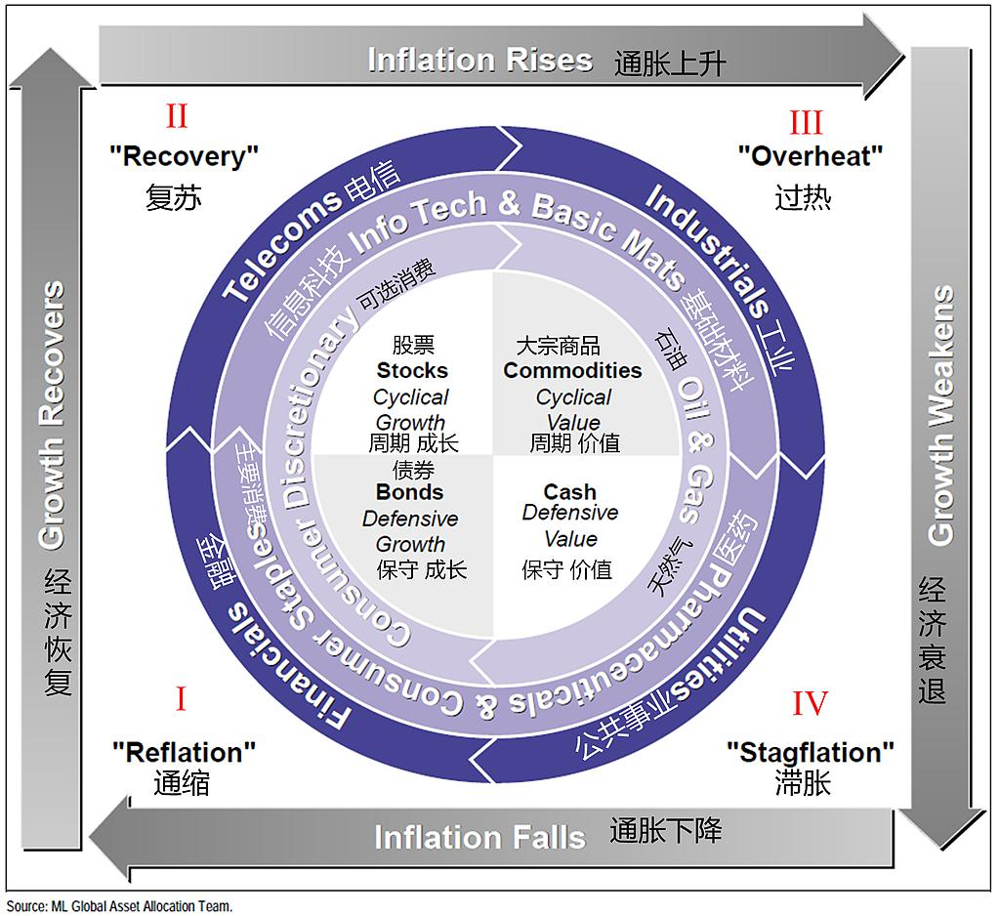

# 第7章 资产配置 第2节 美林时钟 {.unnumbered}

## 引言

在资产配置研究和工作中，如何前瞻的预判宏观经济趋势，捕捉大类资产配置周期性机会，规避风险，是所有专业投资者面临的重要课题。以“投资时钟”为代表的宏观周期分析框架，为我们提供了在宏观经济的不同阶段进行战略性资产轮动的理论基石。

我们将在未来两个章节，详细的梳理与剖析两种最具影响力的经典周期理论：美林投资时钟（Merrill Lynch Investment Clock）与普林格经济周期模型（Pring's Six-Stage Model），并深入探讨这些理论在中国独特的经济与政策环境下，如何被修正、重构，最终演化出更具本土适应性的“货币-信用”分析框架。

美林时钟，作为2004年由美林证券提出的宏观资产配置理论，以其简洁优雅的逻辑框架，一度成为全球投资者的重要参考工具。它试图通过经济增长（Growth）和通货膨胀（Inflation）两个核心宏观变量，将经济周期划分为四个可预测的阶段：衰退、复苏、过热、滞胀，并为每个阶段指定了表现最优的大类资产。

然而，这一诞生于成熟市场历史数据之上的理论，在进入中国这个结构性特征鲜明、政策影响力巨大的新兴市场后，遭遇了严重的“水土不服”，其实际应用效果一度被市场戏称为“美的电风扇”，时转时停，甚至反转。

本文，我们将对美林时钟理论进行简单回顾，而后深入剖析其在中国市场“失灵”的根本原因，并系统的梳理国内投资机构在实践中如何对其进行“本土化改造”。最后我们将看到，一个经典的二维框架，如何在中国特色的宏观环境中，演化为一个包含政策、信用、流动性等多维度的、更具动态适应性的分析范式。这不仅仅是一个投资模型的迭代过程，更是深刻理解中国宏观经济与资本市场联动机制的必经之路。

## 一、经典美林时钟的理论框架与逻辑

在深入探讨其在中国应用的复杂性之前，我们必须首先精准地理解经典美林时钟的理论内核。它的核心魅力在于，将复杂的宏观经济波动简化为一个可循环、可识别的“时钟”，为资产配置提供了看似清晰的路线图。

### 1.时钟的核心驱动：经济增长与通货膨胀

美林时钟的理论基石是两个宏观经济中最核心的指标：经济增长和通货膨胀。通常，经济增长的代理变量是国内生产总值（GDP）的增长率，或者更精确地说，是产出缺口（Output Gap），即实际产出与潜在产出的差额。通货膨胀的代理变量则是居民消费价格指数（CPI）的年增长率。

理论上，这两个指标的交叉组合，构成了经济周期的四个象限：低增长，低通胀；高增长，低通胀；高增长，高通胀；低增长，高通胀。这四个象限，分别对应着美林时钟的四个阶段。该理论的精髓在于，它不仅描述了经济状态，更重要的是揭示了在不同经济状态下，各大类资产（股票、债券、大宗商品、现金）的相对表现优劣顺序。

### 2.时钟的四个周期阶段与资产轮动

美林时钟的四个阶段以顺时针方向轮动，每个阶段都有其典型的宏观经济特征和相应的最优资产类别。

### 2.1.第一阶段：衰退期（Recession），债券为王

宏观特征：经济增长乏力甚至为负（产出缺口为负且不断扩大），通货膨胀持续下行。企业盈利能力大幅下滑，消费者信心疲弱，市场需求不振。

政策应对：在此阶段，为了刺激经济，中央银行通常会采取宽松的货币政策，即降息和/或量化宽松。这导致市场利率下行。

资产表现：

-   债券最优：债券价格与利率成反比。央行的降息周期直接推动债券价格上涨，使其成为衰退期表现最好的资产。投资者寻求避险，国债等高信用等级债券尤为受益。

-   股票最差：企业盈利预期悲观，盈利能力恶化，直接打压股价。即使估值下降，但盈利下滑的“戴维斯双杀”效应往往更为显著。

-   大宗商品疲软：经济活动萎缩导致对原材料和能源的需求下降，大宗商品价格承压。

-   现金中性偏好：虽然现金的实际回报率可能因降息而降低，但在股市和商品市场大幅下跌时，持有现金提供了宝贵的资本保全和流动性。

### 2.2.第二阶段：复苏期（Recovery），股票牛市

宏观特征：经济增长开始触底回升（产出缺口收窄），但由于经济中仍存在大量闲置产能，通货膨胀依然保持在低位。企业盈利开始修复，市场信心逐步恢复。

政策应对：货币政策通常维持宽松，为经济复苏提供支持。财政政策也可能积极发力。低利率环境依然存在。

资产表现：

-   股票最优：这是股票的黄金时期。经济复苏带来企业盈利的快速增长，而宽松的流动性和低利率环境则为股票估值提供了强力支撑，形成“戴维斯双击”。周期性股票（如工业、材料、非必需消费）往往表现突出。

-   债券承压：随着经济好转，通胀预期开始抬头，市场对未来加息的预期逐渐形成，长期债券的收益率开始上升，价格面临下行压力。债券牛市接近尾声。

-   大宗商品开始回暖：经济活动的恢复带动了对商品的需求，价格开始反弹。

-   现金吸引力下降：在股市强劲上涨的背景下，持有现金的机会成本变得非常高。

### 2.3.第三阶段：过热期（Overheat），商品盛宴

宏观特征：经济增长率持续高于潜在增长水平（产出缺口转正并扩大），产能利用率达到极限，劳动力市场紧张，通货膨胀显著上升。

政策应对：为了抑制通胀，中央银行开始实施紧缩的货币政策，即加息或缩减资产负债表。

资产表现：

-   大宗商品最优：强劲的经济增长和高涨的通胀是推动大宗商品价格上涨的完美组合。作为通胀的直接对冲工具，商品在此时期备受青睐。

-    股票表现分化，整体承压：尽管企业盈利仍在增长，但持续的加息会打压股票估值。同时，原材料和劳动力成本上升也会侵蚀企业利润率。股市波动加剧，牛市进入后半场甚至尾声。

-   债券最差：央行持续加息，债券市场进入熊市。持有债券意味着持续的资本损失。

-   现金吸引力回升：随着利率上升，持有现金的利息收益增加，其作为避险资产的价值开始显现。

### 2.4.第四阶段：滞胀期（Stagflation），“现金为王”

宏观特征：这是最坏的经济状态。经济增长开始放缓甚至停滞，但通货膨胀依然居高不下。企业面临成本上升和需求下降的双重挤压，盈利急剧恶化。

政策应对：央行面临两难困境。若要抑制通胀，需要继续加息，但这会进一步扼杀经济增长；若要刺激经济，降息又可能加剧通胀。政策空间非常狭窄，通常会优先控制通胀。

资产表现：

-    现金最优：在股票和债券双双下跌的环境下，现金是唯一能够保全资本的资产。高利率也使得持有现金的回报不菲。此外，黄金在此阶段具有良好的避险属性。

-   股票表现糟糕：企业盈利预期恶化，高利率环境压制估值，股市通常会经历熊市。

-   债券表现糟糕：尽管经济增长放缓，但为了对抗顽固的通胀，央行可能无法迅速降息，甚至可能维持高利率。债券市场依然承压。

-   大宗商品回落：经济增长放缓最终会导致对商品需求的减弱，商品牛市见顶回落，但其回落速度可能慢于股票。

### 3.时钟理论的前提条件

美林时钟的理论之所以广为流传，在于其逻辑闭环的优雅性：经济周期驱动央行政策，央行政策（利率）作为核心变量影响各类资产的估值和相对吸引力，从而引发资产间的轮动。它为投资者提供了一个简洁、动态的宏观对冲策略框架。

然而，这种优雅是建立在一系列强假设之上的，这些假设并非放之四海而皆准，其规律仅限于美国等成熟的发达经济体，以及在20世纪70年代至21世纪初的特定的历史时期内。其隐含的前提条件包括：

-   市场化的经济体系：经济能够自发地进行周期性波动，政府干预相对有限且有规律。

-   明确的政策目标：央行货币政策以控制通胀和促进就业为首要目标，其行为模式是可预测的。

-   利率是资产定价的核心锚：利率的变动能有效地传导至各类资产的定价中。

-   清晰的周期划分：经济增长与通胀之间存在着可识别的、稳定的领先或滞后关系，四个阶段界限分明。

当我们将时钟理论应用于中国市场，会发现上述几乎每一个前提条件都受到了严峻的挑战，必然导致了时钟理论的彻底失效。

## 二、美林时钟在中国的实践困境

过去二十年，许多国内外的研究者和投资机构都不断的尝试将美林时钟框架直接应用于中国市场，但结果往往差强人意。实践证明，中国的宏观经济和市场运行逻辑与美林时钟的经典范式存在巨大差异，导致该模型频繁“失灵”。

### 1.挑战一：“中国特色”的经济周期

美林时钟的起点是“周期”，但中国的经济运行在过去数十年呈现出与西方经典周期理论显著不同的特征。

一方面，自改革开放以来，尤其是加入WTO以来，中国经济的主旋律是高速的、趋势性的增长，而非在零增长上下波动的“周期”。即便我们经历了经济增速从10%以上逐步回落至中高速的“换挡”，但并未出现过西方经济学意义上产出绝对下降的“衰退期”。因此，美林时钟中关于“衰退”和“复苏”的定义在中国情境下变得模糊不清。用产出缺口来衡量，由于中国潜在增长率本身在动态变化，其测算也极具挑战。

另一方面，中国强大的宏观调控体系，尤其是积极的财政政策和逆周期调节的货币政策，极大地“熨平”了经济的自然波动。当经济面临下行压力时，政府主导的基建投资等政策工具会迅速介入，托底经济，从而使得经济周期的振幅变小，阶段切换的信号变得微弱和不规则。经济周期不再是纯粹的市场内生行为，而是内生动力与外生政策强力干预的混合体。

### 2.挑战二：“多目标”的政策函数与利率传导不畅

经典美林时钟假设央行是货币政策目标单一，主要盯住通胀和增长，但在中国，货币政策的目标更为复杂和多元化。

中国人民银行的货币政策不仅要关注经济增长和物价稳定，还要兼顾金融稳定、国际收支平衡、汇率稳定乃至结构性改革等多重目标。这使得其政策行为函数远比美林时钟所假设的要复杂。例如，有时为了防控金融风险（去杠杆），央行可能会在经济增长尚未过热时就收紧流动性；有时为了支持特定产业（如普惠金融、科技创新），会采用结构性货币政策工具，造成“总量平稳，结构分化”的局面。这种复杂性使得预测央行行为变得困难，打破了美林时钟的政策传导逻辑链。

在过去很长一段时间里，中国的利率体系尚未完全市场化，存在“利率双轨制”，政策利率向信贷市场和资产价格的传导并不总像成熟市场那样顺畅，即利率传导机制的梗阻。资产的定价不仅受无风险利率影响，更受到信贷的可得性（即“信用”）的巨大影响。这使得单纯依靠利率变动来判断资产轮动的逻辑大打折扣。

### 3.挑战三：数据指标的适用性问题

增长指标方面，官方未公布产出缺口数据。而作为替代的GDP数据是季度发布的，频率低且存在时滞，对于高频的资产配置决策而言过于滞后。其他高频指标如工业增加值、发电量等虽然能部分反映经济景气度，但其与整体经济的关联度也在随经济结构转型而变化。

通胀指标方面，中国的CPI构成中，食品（尤其是猪肉）权重较高，使得CPI波动常受到供给侧冲击的巨大影响，例如“猪周期”，而不能完全反映总需求的变化。

与此同时，更能反映工业需求的生产者价格指数（PPI）则与全球大宗商品价格高度相关，其波动常与CPI出现背离。究竟哪个指标更能代表美林时钟意义上的“通胀”，在不同时期结论完全不同，这给阶段判断带来了极大的困扰。

### 4.挑战四：投资者结构与资产定价逻辑

中国资本市场的投资者结构和资产定价逻辑，也与美林时钟的成熟市场假设有别。长期以来，A股市场的表现出很强的“政策市”与“情绪市”特征。市场运行在很大程度上受到政策预期、改革议程、监管动向和投资者情绪的影响。一个重要的产业政策或改革文件，其对相关板块股价的驱动力可能在短期内远远超过宏观基本面的变化。这种“事件驱动”和“主题驱动”的特征，削弱了宏观经济周期作为资产定价主导因素的地位。

另一方面，流动性的变化对市场起到了决定性作用。相比于经济基本面，中国的资产价格，尤其是股票和房地产，对流动性的变化更为敏感。这里的流动性不仅指货币供给（Money），更指社会信用扩张的总量（Credit）。“宽货币”到“宽信用”的传导过程，往往是驱动市场牛熊转换的关键。经典美林时钟在中国“失灵”的核心原因之一是，未将流动性/信用作为一个独立的维度进行考察。

正是在这些系统性差异的共同作用下，直接套用美林时钟在中国进行大类资产配置，往往会得出错误的结论。例如，在某些经济下行、本应配置债券的“衰退”阶段，由于强烈的政策宽松预期，股市反而可能因为“政策底”的出现而提前见底反弹。又如，在经济数据看似进入“滞胀”的阶段，资产表现却可能因为供给侧改革的推进而呈现出“股债双杀”之外的复杂格局。美林时钟，在中国市场的复杂气候中，时常表现出指针摇摆不定，甚至逆向旋转。

## 三、美林时钟的“本土化改造”

面对经典美林时钟理论框架的失效，中国的投资者和研究者并对其进行了深刻的反思和大刀阔斧的“本土化改造”。这种改造的核心，是从一个二维的、由经济内生决定的框架，演变为一个多维的、政策与市场紧密互动的分析范式。

### 1.改造一：引入“政策/信用”轴

这是所有本土化改造中最为关键的一步。研究者们普遍认识到，在中国的宏观分析框架中，独立于经济增长和通货膨胀的“政策”或“信用”周期，是理解资产轮动的“第三个轮子”。

与西方经济中信用扩张通常顺周期而动不同，中国的信用周期（通常以社会融资规模存量增速为代理变量）具有极强的独立性，并具有极强的的逆周期调节特性。在经济下行时，政策引导“宽信用”以托底经济；在经济过热或金融风险累积时，政策引导“紧信用”以降温去杠杆。因此，信用周期本身就成为一个领先于经济周期的、由政策决定的关键变量。

基于上述逻辑，可以构建**“增长-通胀-信用”三维框架**。在这个新的三维框架下，资产配置的逻辑发生了细化和改变。例如，同样是“经济下行、通胀下行”的“衰退”象限，可以根据信用周期的不同，进一步细分为：

-    “衰退+紧信用”：这是最差的组合，对应政策去杠杆和经济下行叠加，市场往往经历剧烈下跌，现金为王。

-    “衰退+宽信用”：这是“政策底”的明确信号，虽然经济基本面仍在恶化，但宽信用预示着未来经济的复苏和企业盈利的修复。此时，股市往往领先于经济基本面见底，是战略性布局股票的窗口期，而债券牛市也仍在持续。

通过引入信用维度，原本模糊的周期拐点变得清晰，许多看似“反常”的资产表现得到了合理解释。这个三维框架也被一些机构称为“中国特色的投资时钟”或“宏观三因子模型”。

### 2.改造二：指标体系的“本土化”重构

为了解决原始指标水土不服的问题，国内机构进行了大量的实证研究，寻找更适合中国国情的代理变量。对于增长指标重构，放弃难以测算且低频的产出缺口和GDP，转而使用一系列更高频、更贴近实体经济景气度的指标组合。例如：

-   工业端包括：工业增加值（VAI）增速、制造业PMI、发电量、铁路货运量、挖掘机销量等；

-   需求端包括：社会消费品零售总额、房地产销售面积、出口增速等。

通过对这些高频数据进行加权或合成，可以构建一个更及时的中国经济景气指数，作为新的“增长”轴。

对于通胀指标重构，不再拘泥于CPI或PPI的单一选择，而是根据不同经济环境和分析目的，动态地使用或组合它们。例如：

-   核心CPI，剔除食品和能源价格波动后，更能反映真实的总需求状况。

-   “PPI-CPI”剪刀差，被广泛用于分析中下游行业的利润分配格局。剪刀差扩大，PPI上行快于CPI，意味着上游侵蚀中下游利润，利好上游周期股；剪刀差收窄则反之。

-   还有一些机构会构建包含CPI、PPI、房价等多种价格因素的综合通胀指数，以更全面地刻画宏观价格压力。 综合通胀指数：

### 3.改造三：构建“货币-信用”周期

在经典美林时钟中，流动性（利率）是经济周期的结果。而在中国的实践中，流动性环境本身就是一个极其重要的、甚至常常是主导性的定价因子。因此，本土化改造的另一个重要方向是建立独立的流动性分析框架。

首先，流动性分析被细化为“货币”和“信用”两个层面。

-   货币（Money）：主要指银行间市场的流动性，由央行的公开市场操作、存款准备金率等政策工具决定，代理指标包括DR007等短期市场利率。

-   信用（Credit）：主要指实体经济获得的融资总量，由信贷政策、监管政策等决定，代理指标是社融增速。

构建“货币-信用”周期矩阵，通过分析“货币”的松紧和“信用”的宽紧，可以形成四种组合，每种组合都对应着不同的资产表现：

-   宽货币+紧信用：对应经典美林时钟的衰退期，资金在金融体系内“空转”，利率下行，利好债券，但实体经济融资难，股票缺乏基本面支撑，可能出现“资产荒”下的结构性行情。

-   宽货币+宽信用：对应经典美林时钟的复苏期，最优的宏观环境，股债双牛的概率最高。

-   紧货币+宽信用：对应经典美林时钟的过热期，政策意图是“脱虚向实”，引导资金进入实体，但金融市场流动性收紧，对股债估值均构成压力。

-   紧货币+紧信用：对应经典美林时钟的滞胀期，最差的宏观环境，股债双杀。

这个矩阵分析，有时会与“增长-通胀-信用”的三维时钟框架结合使用，共同构成了中国大类资产配置决策的重要工具。

### 4.改造四：加入“结构性”与“改革”视角

与“增长-通胀-信用”周期性波动同样重要的是中国的结构性变迁和改革的过程。时钟理论框架的本土化，必须能够将长期的结构性趋势与中短期的周期性波动结合起来。

中国的产业政策和改革举措，对于市场产生的影响往往非对称，如供给侧结构性改革、“双碳”目标、发展“新质生产力”等，往往会对特定行业和资产类别产生深远且非对称的影响。例如：在宏观经济整体下行周期中，符合国家战略方向的新兴产业（如新能源、半导体）可能因为强大的政策支持而走出独立的牛市行情。

因此，要在时钟之上叠加“赛道”选择，这意味着，即使美林时钟判断当前处于应配置债券的“衰退期”，一个更优的策略可能是在低配股票总仓位的同时，结构性地超配那些受益于长期政策红利的“核心赛道”。

同理，资产配置不再是简单的“股/债/商/现”之间的轮动，而是在大类资产内部，增加了基于产业政策和结构趋势的行业/风格选择。

## 四、前沿实践框架：动态多维投资决策系统

经过以上的“本土化改造”，改造后的“投资时钟”可能早已不是美林证券当年那张简洁的二维图表，而已经演化为一个动态的、多维度的宏观决策支持系统。其日常运作流程大致如下：

-   输入层：高频宏观数据监控

    -   增长模块：实时跟踪工业增加值、PMI、发电量、信贷脉冲、出口订单等一系列高频指标，合成实时经济景气指数。

    -   通胀模块：监测CPI、PPI、核心CPI、主要商品价格、猪粮比等数据，判断通胀的水平、趋势和结构。

    -   流动性模块：紧盯DR007、Shibor、国债收益率曲线、社融存量增速、M1/M2增速等指标，评估“货币”和“信用”的松紧状态。

    -   政策模块：这是最具“中国特色”的模块，通过文本分析等量化手段，解读中央政治局会议、中央经济工作会议、政府工作报告、央行货币政策执行报告等关键文件，量化政策信号的边际变化。

-   分析层：多维框架定位

    -   “增长-通胀”定位：首先，在经典的二维平面上确定当前经济所处的大致象限。

    -    “信用/政策”修正：接着，用信用周期和政策信号对初步判断进行修正。例如，经济数据指向“衰退”，但信用脉冲已强劲回升，且政策会议释放强烈稳增长信号，那么对风险资产的评估就需要从“悲观”转向“谨慎乐观”。

    -    “流动性环境”确认：最后，用“货币-信用”矩阵来确认金融市场的环境。例如，即使“宽信用”已经启动，但如果银行间市场流动性（货币）仍然紧张，那么资产价格的反弹可能会一波三折。

-   输出层：大类资产强弱排序

    -   生成资产胜率排序：综合以上所有维度的分析，系统会输出当前宏观环境下，股票、债券、商品、现金等大类资产的预期表现排序。

    -   细化至行业/风格配置：在大类资产配置比例确定的基础上，结合对产业政策、改革议程和估值水平的分析，进一步给出在股票内部应超配/低配的行业（如周期vs成长，大盘vs小盘）和在债券内部应选择的久期和信用等级。

以2024-2025年的市场为例：宏观经济数据呈现出典型的“弱复苏”特征，增长动能不强，通胀温和。如果严格按照经典美林时钟，这介于“衰退”末期和“复苏”初期之间，股票的吸引力应逐步增加。然而，本土化框架会发现，尽管经济增长数据温和，但中央持续强调发展“新质生产力”，并出台了一系列针对人工智能、先进制造、生物科技的强力支持政策。同时，信用扩张呈现出明显的结构性特征，大量资金被引导至这些重点领域。因此，正确的决策并非笼统地增配股票，而是在控制总仓位的同时，极大地超配受益于“新质生产力”政策的科技成长板块，同时低配与传统经济周期关联度高的板块。这一决策的成功，正是本土化改造框架价值的体现。

## 五、结论

对于中国的量化投资者而言，美林时钟的价值已经不在于其原始的、刻板的四阶段轮动预测，而在于它提供了一个思考“宏观-资产”联动的初始逻辑框架。

中国市场的投研人员，通过解构、重组和增维，将这个古典时钟升级为了一个更适应中国国情的、复杂的“仪表盘”。它不仅有经济增长和通胀的指针，更有信用周期、流动性松紧、政策风向等多个关键刻度。

模型永远在演化，市场永远在变化。随着中国经济结构的进一步转型、金融市场的进一步开放、全球宏观环境的变迁，今天我们所演示这套框架，未来也必然会而不断迭代升级。对宏观经济与资本市场联动机制的深刻理解、对本土化特征的持续敬畏、以及对分析框架的不断扬弃，才是穿越周期的真正智慧。
