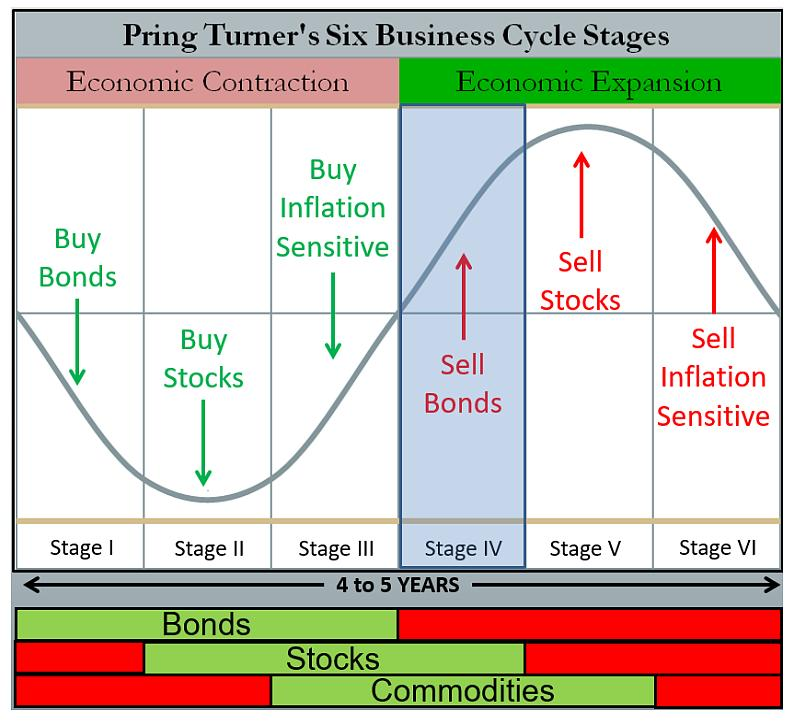

# 第7章 资产配置 第3节 普林格六周期  {.unnumbered}

## 引言

本节我们将继续介绍在宏观经济周期研究与大类资产配置领域占据重要地位的“普林格六周期理论”（Pring's Six Business Cycles）。作为美林投资时钟理论的精妙延伸与改良，普林格周期通过引入流动性作为先行指标，构建了一个更为立体和动态的经济周期分析框架。

首先，我们将详细阐述该理论的核心逻辑，以及“先行、同步、滞后”三类关键指标的内在传导机制，并逐一解构其划分的六个阶段的宏观经济特征与经典的大类资产配置范式。之后，我们将深入探讨普林格周期理论在中国这一独特且充满活力的市场中的本土化实践与修正。最后，报告将从量化投资的实操视角出发，阐述如何将抽象的周期阶段判断，转化为一套可执行、可回测、可优化的量化资产配置规则。这包括指标选择与数据处理、周期信号的合成与识别、资产配置权重的动态调整逻辑，以及构建稳健回测框架的关键考量。我们致力于为投资者提供一个兼具理论深度与实践指导意义的综合性宏观配置框架。

## 一、普林格六周期理论的框架与逻辑

在全球宏观对冲基金和资产配置管理者的工具箱中，基于经济周期进行资产轮动配置始终是核心策略之一。在众多理论模型中，由著名技术分析大师马丁·普林格（Martin Pring）提出的六周期理论，因其逻辑的完备性和对市场动态的精细刻画而备受推崇。

### 1.理论渊源：从美林时钟到普林格周期

马丁·普林格的六周期理论源于其对债券、股票和商品这三大主要资产类别市场周期性顶部与底部的先后关系的深刻洞察。

普林格观察到，从历史数据来看，债券市场通常最先见底并开启牛市，因为利率的下降或预期下降是经济复苏的前奏；股票市场随后跟进，在经济确认复苏、企业盈利预期改善时进入牛市；商品市场的牛市通常出现在经济周期的后半段，与通货膨胀的上升和经济的过热紧密相关。这种“债券 -\> 股票 -\> 商品”的轮动顺序是普林格周期理论的基石。通过观察这三大资产价格的相对强弱，可以为判断经济所处阶段提供关键线索 。

要理解普林格周期，我们必须先回顾“美林时钟”。美林时钟开创性地将经济周期划分为“衰退、复苏、过热、滞胀”四个象限，并分别对应着“债券、股票、商品、现金”的投资阶段。这个经济增长与通胀二维框架，为大类资产配置提供了宏观叙事的“第一性原理”。

但随着全球金融市场的深化和复杂化，尤其是在央行货币政策扮演越来越重要角色的时代，仅靠增长和通胀两个维度有时显得力不从心。马丁·普林格敏锐地洞察到这一点，他的核心贡献在于，在美林时钟的基础上，显性地引入了第三个关键维度，流动性和信贷周期。他认为，在经济机器的传动链条中，流动性的变化往往领先于实体经济的增长，而实体经济的增长又领先于通货膨胀的变化。这种“领先-同步-滞后”的序列关系，构成了普林格周期理论的基础。通过将经典的四阶段细化为六个阶段，普林格周期能够更精确地捕捉经济从一个状态到另一个状态的过渡期，从而为战术性资产配置提供更为敏锐的指引。

### 2.核心逻辑：三类指标的传导链条

普林格周期的核心分析框架，是围绕三组相互关联且存在时序差异的宏观经济指标展开的：

-   先行指标（Leading Indicators）：主要反映流动性与信贷环境。

    在经典的普林格框架中，通常使用广义货币供应量（M2）或狭义货币供应量（M1）的同比增速作为代理变量。其逻辑在于，中央银行的货币政策，如降息、降准等会首先作用于金融体系的流动性，表现为货币供应的扩张或收缩。流动性的宽裕会降低企业和个人的融资成本，刺激投资和消费意愿，是未来经济活动的“先行燃料”。因此，这类指标的拐点通常领先于经济本身的拐点。

-   同步指标（Coincident Indicators）：主要反映实体经济的景气程度。

    国内生产总值（GDP）的同比增速或工业增加值同比增速是其最经典的代表。这些指标直接衡量当前经济活动的产出和强度。当流动性等先行指标持续改善后，会逐渐传导至实体经济，表现为企业生产扩张、就业改善和消费增长，从而推动同步指标的回升。反之亦然。

-   滞后指标（Lagging Indicators）：主要反映通货膨胀的压力。

    生产者价格指数（PPI）或消费者价格指数（CPI）的同比增速是常用的滞后指标。当经济活动（同步指标）持续扩张，需求旺盛，并传导至上游原材料和下游消费品时，物价水平便会开始上涨。由于价格调整相对于产出调整存在粘性，通胀的拐点通常滞后于经济增长的拐点。

这三者之间形成了一条清晰的传导链条：“货币松紧→经济冷热→通胀高低”。普林格周期理论的精髓，就在于通过观察这三类指标的边际变化，上升、下降、见顶、触底等，来判断经济周期所处的具体阶段。

### 3.普林格六阶段详解：宏观特征与资产配置范式

基于上述三类指标的轮动关系，普林格将一个完整的经济周期划分为六个阶段。需要注意的是，不同文献对各阶段的命名略有差异，但其内在的宏观经济学含义是一致的。以下是对六个阶段的标准化描述：

### 3.1.阶段一：复苏初期（或称萧条末期/逆周期调节期）

宏观特征：这是经济最坏的时刻，但也是希望的开始。此时，经济增速（同步指标）仍在下滑或处于底部徘徊，通胀（滞后指标）也因需求疲弱而持续下行。但关键的变化在于，为了应对经济衰退，政府和央行已经开始实施强力的逆周期调节，表现为先行指标（流动性）率先触底反弹，开始进入上升通道。

简单概括为：流动性↑，经济↓，通胀↓。

资产配置：此阶段的核心逻辑是“衰退式宽松”。利率下行是主旋律。因此，债券是绝对的王者。随着央行降息，债券价格持续上涨。现金虽然安全，但随着利率走低，其吸引力下降。股票市场可能仍在寻底，但对利率敏感的板块（如公用事业、高股息股票）和未来经济复苏的预期开始让聪明的资金左侧布局，市场开始从绝望走向希望。商品则因全球需求疲软而继续承压。

核心配置：债券\>现金\>股票\>商品。

### 3.2.阶段二：复苏末期（或称全面复苏期）

宏观特征：流动性的持续注入开始显现效果。先行指标（流动性）继续上行，更重要的是，同步指标（经济增速）也确认触底反弹，进入上升通道。此时，经济从复苏走向扩张。由于产能过剩尚未完全消化，通胀（滞后指标）依然在低位运行，甚至可能继续探底。

简单概括为：流动性↑，经济↑，通胀↓。

资产配置：这是典型的“增长友好”环境，即“高增长、低通胀”的黄金组合，对风险资产极为有利。经济基本面的改善驱动企业盈利预期大幅上修，而低通胀环境又使得央行没有收紧货币政策的压力。因此，股票成为表现最佳的资产。这个阶段通常是股票牛市最猛烈、最确定的主升浪。债券虽然仍受益于低通胀，但随着经济走强，其相对吸引力开始弱于股票。商品价格可能开始企稳，但尚未迎来大行情。

核心配置：股票\>债券\>现金\>商品。

### 3.3.阶段三：过热初期（或称繁荣期）

宏观特征：经济全面繁荣。先行指标（流动性）可能因前期过快增长而边际放缓，但仍在高位。同步指标（经济增速）继续强劲上行，甚至开始加速。关键变化在于，持续的需求扩张终于传导至价格端，滞后指标（通胀）确认触底反弹，进入上升通道。

简单概括为：流动性→或↓，经济↑，通胀↑。

资产配置：此阶段是“增长与通胀共舞”。经济的强劲势头继续支撑企业盈利，股票市场依然表现良好，但波动可能开始加大。更引人注目的是商品，受益于强劲的实体需求和通胀预期的双重推动，商品开始进入牛市，表现往往超越股票。债券市场则面临压力，因为通胀上行和未来可能的货币紧缩预期会压制债券价格。

核心配置：商品\>股票\>现金\>债券。

### 3.4.阶段四：过热末期

宏观特征：经济过热的迹象愈发明显，通胀压力持续加大。为了抑制通胀，央行开始收紧货币政策（加息、收紧信贷），导致先行指标（流动性）确认见顶回落，进入下降通道。然而，由于经济的惯性，同步指标（经济增速）此时可能仍在冲顶或高位运行。滞后指标（通胀）则继续加速上行。

简单概括为：流动性↓，经济↑或→，通胀↑。

资产配置：这是“紧缩式繁荣”，市场进入最复杂的阶段。流动性收紧对股票估值构成压力，但强劲的盈利增长在短期内仍能提供支撑，市场往往表现为高位震荡或“最后一舞”。商品在此阶段依然是最佳选择，因为通胀仍在加速，是最好的通胀对冲工具。债券市场继续承压，是最差的配置品种。此时，持有部分现金以应对流动性风险变得重要。

核心配置：商品\>现金=股票\>债券。

### 3.5.阶段五：滞胀期（Stagflation）

宏观特征：货币紧缩的滞后效应开始全面显现。先行指标（流动性）继续下行。同步指标（经济增速）确认见顶回落，经济开始步入下行通道。然而，由于价格粘性和成本推动等因素，滞后指标（通胀）此时仍在冲顶或高位运行，尚未回落。这就形成了“经济停滞”与“通货膨胀”并存的尴尬局面。

简单概括为：流动性↓，经济↓，通胀↑或→。

资产配置：这是对所有金融资产都极不友好的阶段，俗称“股债双杀”。经济下行打击企业盈利，股票承压。通胀高企和持续的紧缩预期打击债券价格。在此阶段，现金为王的逻辑开始凸显。同时，作为传统避险和抗通胀资产，黄金的表现往往脱颖而出。部分大宗商品可能因供给侧因素仍有表现，但整体已是强弩之末。

核心配置：现金/黄金\>商品\>债券\>股票。

### 3.6.阶段六：衰退期（Recession）

宏观特征：经济进入全面衰退。先行指标（流动性）在低位徘徊或继续下行。同步指标（经济增速）加速下滑。关键变化在于，经济的深度衰退终于压制了总需求，滞后指标（通胀）确认见顶回落，进入下降通道。这为下一轮的货币宽松打开了政策空间。

简单概括为：流动性↓或→，经济↓，通胀↓。

资产配置：这是“衰退式紧缩”的末期。股票市场在盈利和估值的双重压力下继续寻底。商品价格因需求萎缩而大幅下跌。然而，随着通胀回落，市场开始预期央行将转向宽松，利率下行的预期重新燃起。因此，债券的配置价值重新显现，开始筑底并逐步走牛，成为黑暗中的一丝曙光。黄金作为避险资产也仍有配置价值。

核心配置：债券/黄金\>现金\>股票\>商品。

至此，一个完整的六阶段周期循环结束，经济在衰退的谷底孕育着新一轮复苏的希望，即将再次进入阶段一。其中，阶段一复苏初期、阶段二复苏末期、阶段三过热初期，三期合并称为扩张半周期（Expansion Phase）；阶段四过热末期、阶段五滞胀期、阶段六衰退期、三期合并称为收缩半周期（Contraction Phase）。

**普林格六周期各阶段特征综合分析表**

| 阶段 | 阶段命名变体 | 核心宏观经济特征 | 主要资产典型表现 |
|:-----------------|:-----------------|:-----------------|:-----------------|
| 阶段一 | 衰退末期/经济失速/债券牛市 | 经济活动处于低谷或仍在下滑，通胀下行，企业盈利差。货币政策开始宽松，利率持续下降或处于低位。政府可能开始逆周期调节。 | 债券：表现最佳，进入牛市。股票：熊市末期，可能仍在探底。商品：熊市，需求疲软。现金：仍是较好的避险选择。 |
| 阶段二 | 复苏初期/只有商品是熊市 | 经济开始显现触底回升迹象，领先指标改善。利率维持在低位，信贷开始扩张。市场信心逐步恢复，但通胀依然温和。 | 债券：仍在牛市，但收益率上升空间有限。股票：开启牛市，表现开始超越债券。商品：仍在熊市，但可能开始筑底。现金：配置价值下降。 |
| 阶段三 | 复苏末期/三市牛市 | 经济确认进入复苏和扩张通道，GDP增长加速，企业盈利强劲。通胀开始温和上行，但尚未构成威胁。 | 债券：牛市进入末期，收益率开始面临上行压力。股票：处于牛市主升浪，表现强劲。商品：需求回暖，开启牛市。现金：机会成本高，配置价值最低。 |
| 阶段四 | 过热初期/债券熊市，股商品牛 | 经济增长强劲甚至出现过热迹象，产能利用率高。通胀压力明显加大，促使货币政策开始收紧，利率上升。 | 债券：转向熊市，价格下跌。股票：牛市延续，但波动加剧，板块开始分化，价值股可能优于成长股。商品：牛市延续，受益于通胀预期。现金：配置价值开始回升。 |
| 阶段五 | 滞胀/只有商品是牛市 | 经济增长开始放缓甚至停滞（“滞”），但通胀依然高企（“胀”）。企业盈利受到成本挤压而下滑。政策面临两难。 | 债券：仍处于熊市或底部震荡。股票：转向熊市，盈利和估值双杀。商品：可能是唯一表现良好的资产，成为对抗通胀的工具。现金/黄金：表现优异，成为主要避险资产。 |
| 阶段六 | 衰退初期/三市熊市 | 经济确认进入衰退，GDP负增长，失业率上升。通胀压力开始缓解，为后续货币政策转向宽松创造条件。市场情绪悲观。 | 债券：熊市结束，开始为下一轮牛市筑底。股票：处于熊市主跌浪。商品：因需求萎缩而进入熊市。现金：现金为王，是最佳配置。 |

## 二、普林格周期的量化实现

作为量化投资者，如何将普林格周期这一宏观叙事框架，转化为一套客观、系统、可执行的投资策略。这个过程大致可以分为四个关键步骤。

### 1.步骤一：指标选择、量化与数据处理

这是将理论“落地”的第一步，为三类指标选择具体的、可获取的、高频的数据序列。

指标选择：

-   先行指标：经典选择是M1、M2同比增速。在量化模型中，我们还会考察M1-M2剪刀差、社会融资规模（存量或增量）同比增速等，以更全面地捕捉信贷脉冲。

-   同步指标：季度GDP数据频率太低，实战中通常使用月度的工业增加值同比、制造业PMI指数、发电量、铁路货运量等更高频的数据作为代理。

-   滞后指标：月度的CPI和PPI同比增速是标准选择。核心CPI（剔除食品和能源）可以提供更稳定的通胀趋势信号。

数据处理与信号初构：

-   数据清洗：原始数据可能存在缺失值、异常值，需要进行插值或剔除处理。

-   季节性调整：尤其是中国的经济数据受春节等因素影响，季节性效应显著，必须进行季调，如X-12-ARIMA方法，以揭示真实的趋势。

-   信号平滑：月度数据波动较大，直接使用会产生大量噪音交易。通常使用移动平均（如3个月或6个月移动平均）来平滑数据，提取趋势项。

-   趋势判断：如何量化趋势“上升”或“下降”？最简单的方法是比较当前值与前一个月的值。更稳健的方法是观察移动平均线的斜率，或者使用HP滤波、小波分析等更复杂的信号处理技术来分离周期项和趋势项。

### 2.步骤二：信号合成与周期阶段的划分

这是整个量化体系的核心，即如何根据处理后的三组指标信号，自动判断当前经济处于哪个阶段。主流方法有两种：

#### 2.1.方法一：基于规则的“投票”系统

为每个指标的趋势定义清晰的“状态”。如：加速上升、减速上升、见顶回落、加速下降、减速下降、触底反弹，等等。

然后，根据普林格理论中每个阶段的指标组合特征，建立一个“特征库”。例如：

IF（先行指标状态=="触底反弹"）AND（同步指标状态=="加速下降"）AND（滞后指标状态=="加速下降"）

THEN 当前周期阶段=阶段一

这个方法的优点是逻辑清晰，解释性强，直接对应理论。缺点是规则设定较为僵硬，可能无法很好地处理模糊的过渡状态。

| 阶段 | 阶段名称 | 先行指标 | 同步指标 | 滞后指标 | 解读 |
|------------|------------|------------|------------|------------|------------|
| 阶段一 | 衰退末期 | \+ | \- | \- | 政策开始发力，但经济基本面尚未好转，通胀低迷。 |
| 阶段二 | 复苏 | \+ | \+ | \- | 政策效果显现，经济开始复苏，但通胀尚未启动。 |
| 阶段三 | 过热 | \+ | \+ | \+ | 经济、金融、通胀三者共振上行，全面扩张。 |
| 阶段四 | 狂热/过热末期 | \- | \+ | \+ | 金融环境开始收紧，但经济和通胀仍有惯性，是周期顶部信号。 |
| 阶段五 | 滞胀 | \- | \- | \+ | 金融和经济基本面双双走弱，但通胀依然顽固，是最困难的时期。 |
| 阶段六 | 衰退 | \- | \- | \- | 经济、金融、通胀三者共振下行，全面收缩。 |

#### 2.2.方法二：构建综合指数法

这种方法试图将三类指标合成为一个或几个综合指数，通过观察综合指数的数值和变化来判断周期。一种常见的做法是：

-   对每个指标序列进行标准化处理，如Z-Score，消除量纲影响。

-   根据理论或实证经验，为先行、同步、滞后三类指标赋予不同的权重。例如，可以认为先行指标的拐点信息最重要，给予更高权重。

-   将加权后的指标合成为一个“普林格周期综合指数”。

-   通过观察该指数的绝对位置（高/低）和变化方向（上升/下降）来划分周期阶段。例如，指数从低位开始回升，可能对应阶段一、二；指数在高位开始回落，可能对应阶段四、五。

这个方法的优点是更加连续和平滑，能更好地处理过渡期，但缺点是模型的解释性略有下降，且权重的设定有一定主观性。

#### 2.3.方法三：机器学习拟合法

近年来，一些机构开始尝试使用机器学习模型，如Logit回归、隐马尔可夫模型、支持向量机SVM、神经网络等，来识别周期状态。模型可以自动从历史数据中学习不同周期阶段的复杂模式，减少了人为设定规则的主观性。

### 3.步骤三：从周期信号到可执行的资产配置规则

一旦确定了当前的周期阶段信号，下一步就是将其转化为具体的投资组合。该理论的投资应用遵循一个清晰的逻辑链条：

-   识别阶段： 利用第二部分介绍的指标体系，判断当前经济处于哪个周期阶段 。

-   确定配置： 根据所在阶段的资产表现特征（如第一部分的表格所示），制定大类资产的配置策略，即超配该阶段表现强势的资产，低配或规避表现弱势的资产 。

-   动态调整： 持续跟踪宏观指标，当判断经济周期发生阶段转换时，果断调整资产组合，以适应新的市场环境 。

例如，当判断经济从阶段六（衰退）转向阶段一（衰退末期）时，投资者应开始逐步减持现金，增加对债券的配置。而当经济从阶段四（过热）转向阶段五（滞胀）时，则应果断降低股票仓位，转向商品和现金。

#### 3.1.静态配置规则

这是最简单直接的方式。为每个阶段预设一个固定的资产配置比例。例如： 触发阶段二信号：股票60%，债券30%，商品5%，现金5%。 触发阶段五信号：股票10%，债券10%，黄金20%，现金60%。 这种方法的优点是简单、明确。缺点是比较僵化，无法反映信号的强度。

#### 3.2.动态权重调整

更精细化的做法是根据信号的“强度”或“确定性”来动态调整权重。例如，我们可以构建一个“周期确定性分数”（0到1之间）。如果多个指标都明确指向同一个阶段，分数就高；如果指标之间存在分歧，分数就低。然后，根据这个分数来调整偏离基准组合的幅度。分数越高，就越“满仓”该阶段建议的优势资产。此外，还可以结合风险平价模型、均值-方差优化等现代投资组合理论，在周期信号给出的方向性指引下，构建风险收益特征更优的组合。

### 4.步骤四：策略回测与优化

-   回测框架设计：需要构建一个能够模拟真实交易环境的回测引擎，考虑交易成本、滑点、流动性约束等因素。回测的时间跨度应尽可能长，覆盖多个完整的经济周期。

-   绩效评估指标：除了年化收益率，还必须关注风险指标，如最大回撤、夏普比率、索提诺比率、卡玛比率等。这有助于全面评估策略的风险调整后收益。

-   稳健性检验：参数敏感性分析：测试改变模型参数（如移动平均的周期、划分阶段的阈值）对结果的影响。一个稳健的策略不应对参数的微小变动过于敏感。

-   样本外测试：将数据分为训练集（用于构建模型）和测试集（用于检验模型）。在训练集上表现优异但在测试集上表现糟糕的策略，很可能存在“过拟合”问题。

-   情景分析与压力测试：模拟历史上发生过的金融危机、黑天鹅事件等极端情景，观察策略的表现，评估其在极端风险下的生存能力。

通过以上四个步骤，我们就完成了一个将普林格周期理论从宏观叙事转化为严谨量化投资策略的完整闭环。国内许多机构正是沿着这条路径，对普林格周期进行了深入的研究和实践。

### 5.实践中的挑战与局限性

尽管上述判断逻辑清晰，但在实际应用中面临诸多挑战：首先，是缺乏量化标准。现有研究并未提供判断指标“上行”或“下行”的具体计算公式或量化阈值（如同比增速超过/低于多少）。这使得判断过程带有较强的主观性，依赖于研究者的经验。其次，是指标选择与合成。每一类指标都包含多个子项，如何选择、加权并合成为一个综合指数，是应用中的难点 。最后，是数据滞后性： 宏观经济数据本身存在发布延迟，这会影响判断的及时性，可能导致错过最佳的资产配置调整时点。

## 三、普林格周期的“本土化”修正和实践

将任何一个源于西方成熟市场的经典模型，机械照搬的应用于中国，都必然面临“水土不服”的挑战。普林格周期也不例外。直接套用经典框架在中国市场的效果往往不尽如人意。因此，对其进行本土化修正是国内机构实践的重中之重。

### 1.为什么经典模型在中国会“失灵”？

-   **“政策周期”的压倒性影响：**与西方市场主要由内生经济动力和市场自发调节不同，中国经济周期的起伏在很大程度上受到政府宏观调控政策的深刻影响。一个产业政策的出台、一次环保限产的加码、一轮金融去杠杆的决心，其影响的力度和速度往往会打破经典的“流动性→增长→通胀”传导链条。

    例如，强力的行政干预可以迅速改变商品供需格局，导致PPI的波动有时更多反映“供给冲击”而非“需求拉动”，使其作为滞后指标的属性发生扭曲。因此，任何在中国的宏观模型都必须将“政策变量”置于核心位置。

-   **独特的经济增长引擎与结构：**中国经济在过去数十年间高度依赖投资驱动，尤其是房地产和基建驱动。这使得固定资产投资完成额、房地产开发投资额等指标，在判断经济动能方面的重要性甚至超过了消费。这种增长模式也导致了经济对信贷的敏感度极高，信贷的扩张与收缩几乎是同步甚至领先于经济冷热的最关键变量。

-   **金融市场的结构性差异：**中国的资本市场相对年轻，资产类别之间的轮动规律不如美国等拥有上百年数据的市场那般清晰和稳定。A股市场散户占比较高，情绪驱动和主题炒作的现象更为普遍，有时会放大或扭曲宏观基本面的信号。此外，尽管利率市场化已取得长足进步，但政策利率向市场利率的传导机制仍在不断完善中，这会影响债券市场对货币政策的反应速度和幅度。

-   **数据特征与可得性：**部分宏观数据的统计口径、发布频率和历史长度与西方国家存在差异。例如，相比M1/M2，“社会融资规模”被普遍认为更能全面反映中国整体的信用环境。

基于以上原因，对普林格周期进行本土化改造，不仅是必要的，更是提升其在中国市场实战有效性的唯一途径。

### 2.指标、逻辑与周期阶段的重构

国内投资机构，在普林格周期的本土化修正方面进行了大量富有成效的探索。其修改主要集中在以下几个方面。

#### 2.1.指标体系的重构

这是最基础也是最关键的一步。核心思想是用更符合中国经济运行特征的指标来替代或补充经典指标。

-   先行指标：

    M1同比增速和社会融资规模存量同比增速被普遍确立为中国版普林格周期的核心先行指标。M1反映企业活期存款，代表了企业的交易和投资意愿；社融则全面刻画了实体经济从金融体系获得的资金支持，是中国“信用周期”最精准的观察哨。

    此外，除了通过信贷指标观察流动性的“量”，还需通过利率指标观察“价”。DR007、10年期国债收益率等市场利率指标，能更及时地反映银行间市场的流动性松紧和市场对未来经济与政策的预期。

-   同步指标：

    制造业采购经理人指数（PMI）每月度初即发布，可以及时且真实的反映当下经济活动，其涵盖新订单、生产、库存等，具有良好的综合性，在实践中被赋予了极高的权重，常被用作工业增加值的“先行确认”或替代。

    此外，部分前沿机构开始尝试引入更高频的另类数据，如发电耗煤量、主要行业的开工率、拥堵指数、快递物流指数等，以求在官方数据发布前，更早地捕捉经济活动的边际变化。

-   滞后指标：

    在中国，由于产业结构和价格传导机制的原因，主要反映工业品价格的PPI和主要反映消费品价格的CPI经常出现显著分化。PPI受国际大宗商品价格和国内供给侧改革影响巨大，而CPI则易受猪肉、蔬菜等食品价格的短期扰动。因此，在判断通胀压力时，不能简单地看某一个指标，而需要综合分析，并关注剔除食品和能源的核心CPI，以判断真实的需求端通胀压力。

    除了已实现的价格指数，模型中还会加入国债市场隐含的通胀预期（BEI）等前瞻性指标。

#### 2.2.周期划分逻辑的调整

实证研究表明，中国市场的周期运行与经典理论存在显著差异：

-   周期顺序变化：中国经济周期可能出现阶段顺序倒置、跳跃甚至“逆时针”旋转的现象，六个阶段的完整循环很少清晰出现。

-   “政策周期”的主导作用： 与西方市场相比，中国的宏观调控政策对经济周期的影响更为直接和显著。政府的逆周期调节往往能强力干预经济的自然运行轨迹，导致周期特征发生改变。

-   资产轮动不显著：中国市场股\\债\\商三大资产的轮动特征不如美国市场那样鲜明，存在阶段重叠和特征模糊的情况 。仅仅替换指标是不够的，更深层次的本土化在于对周期传导逻辑和阶段划分的重构。

构建“政策底→信用底→经济底”的新传导链，这是对经典普林格传导链最重要的本土化修正。在中国，一个新周期的起点往往不是市场自发的流动性宽松，而是明确的政策转向信号，如中央重要会议释放“稳增长”信号。

政策信号出现后，会引导信贷开始扩张，出现“信用底”；信用扩张一段时间后，才会最终传导至实体经济，带来经济增速的企稳回升，出现“经济底”。这个链条的识别，对于在中国市场进行左侧布局至关重要。

#### 2.3.其他调整

此外，在中国的实践中，阶段六衰退期和阶段一复苏初期的界限往往很模糊。通常，一旦确认通胀回落进入阶段六，市场就会强烈预期政策放松，债券牛市和股票估值修复的逻辑几乎同时启动，使得这两个阶段在资产表现上高度重合。

中国历史上出现的“类滞胀”环境（如2019-2020年），往往是由于供给侧冲击，如猪瘟导致的猪价飙升，引发的结构性通胀，而非全面的需求过热。在这种情况下，货币政策难以大幅收紧，股债表现也与经典滞胀期股债双杀有所不同，呈现结构性行情。

强有力的宏观调控可能导致某些阶段被大大缩短甚至“跳过”。例如，在经济刚有过热苗头时，果断的调控措施可能直接将其压制，使经济跳过典型的阶段四和阶段五，直接进入增速放缓的阶段。反之，在经济面临失速风险时，大规模的刺激政策也可能让经济跳过深度衰退，直接进入复苏通道。

总之，尽管各家机构在指标选择和模型细节上有所差异，但普遍认同普林格周期本土化的核心思路：即强化信用和政策变量，并结合中国经济结构进行逻辑重构。

### 3.小结

综上，普林格周期理论在中国并非一个可以“即插即用”的模板，而是一个需要被深度理解、解构、并用中国本土的“零部件”和“运行逻辑”进行重组的强大分析框架。国内很多机构的实践已经证明，经过精心本土化改造的普林格周期，是量化宏观投资在中国市场取得成功的“金钥匙”之一。

## 四、研究前沿和展望

站在2026年的今天，回望普林格周期理论在中国市场的应用历程，我们可以清晰地看到一条从引进、质疑、到本土化改造并最终创造价值的演进路径。展望未来，这一经典框架的生命力将通过与前沿技术的不断融合而得以延续和升华。未来的普林格周期量化应用将呈现以下发展趋势：

### 1.机器学习模型应用

**动态指标选择与加权：**利用机器学习算法，让模型自动学习在不同宏观环境下，哪些指标的有效性更高，并动态调整其在综合指数中的权重，从而提升模型的适应性。

**非线性模式识别：**运用深度学习等技术，捕捉经济变量之间复杂的非线性关系，以更准确地识别周期的细微变化和非典型模式。

### 2.自然语言处理（NLP）和另类数据的应用

通过自然语言处理（NLP）技术，大规模、实时地分析政府工作报告、央行会议纪要、新闻舆情等文本数据，将其量化为“政策情绪指数”或“市场情绪指数”，作为传统经济指标之外的重要输入变量。

未来的宏观模型将不再局限于官方发布的月度或季度数据。卫星图像（包括：监测港口吞吐量、工厂夜间灯光）、线上招聘数据、信用卡消费数据、供应链信息、商品库存高频数据等另类数据，将为我们提供关于经济活动近乎“实时”的洞察，极大地提升模型的时效性和前瞻性。

### 3.情景分析与压力测试的常态化

量化模型将更加注重“反脆弱性”的构建。通过更复杂的基于主体的建模（Agent-Based Modeling）等方法，模拟不同宏观情景下的市场反应，并将压力测试的结果作为优化投资组合的重要依据，而不仅仅是作为事后评估。

## 五、结论

普林格六周期理论，以其对“流动性-增长-通胀”三维联动的深刻洞察，为我们理解宏观经济的脉搏和驾驭大类资产的轮动提供了优秀的理论框架。它是一个强大的、结构化的宏观分析思维框架。

中国市场的实践证明，这一理论的价值不在于教条式的遵循，而在于创造性的转化。通过对指标体系、传导逻辑和阶段划分进行深度本土化改造，国内量化投资者已经成功地将其锻造为一把能够在中国复杂市场环境中披荆斩棘的利器。

普林格周期的核心思想将历久弥新。未来，随着人工智能、大数据等前沿科技的不断赋能，这一经典框架将被注入新的活力，其捕捉市场规律的精度和速度将达到前所未有的高度。

对于追求长期稳健超额收益的投资者而言，持续深化对普林格周期及其本土化应用的研究，无疑将是在未来十年乃至更长时间里，构建核心竞争力的关键所在。成功将属于那些既能深刻理解宏观逻辑，又能熟练运用量化工具，并始终保持对市场敬畏与谦逊的专业投资者。
